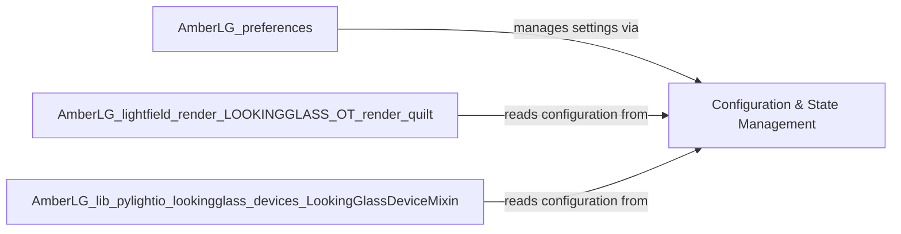

## Details

One paragraph explaining the functionality which is represented by this graph. What the main flow is and what is its purpose.

### Configuration & State Management [[Expand]](./Configuration_State_Management.md)
This component is responsible for centralizing the management of application-wide settings, user preferences, and global variables. Its primary function is to ensure that configuration data is consistently stored, loaded, and accessible across various parts of the add-on, thereby facilitating data persistence and maintaining a shared state. This is crucial for a Blender add-on to remember user settings between sessions and provide a consistent experience.

**Related Classes/Methods**: _None_

### [FAQ](https://github.com/CodeBoarding/GeneratedOnBoardings/tree/main?tab=readme-ov-file#faq)