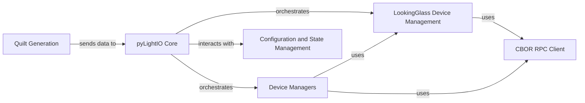

## Details

One paragraph explaining the functionality which is represented by this graph. What the main flow is and what is its purpose.

### pyLightIO Core
The primary entry point and high-level API for the entire device abstraction layer. It exposes a unified interface for sending lightfield data and managing device interactions, orchestrating calls to lower-level components.

**Related Classes/Methods**:

- `AmberLG.lib.pylightio` (1:1)

### LookingGlass Device Management
Manages the specifics of Looking Glass devices, including device discovery, connection handling, and abstracting device-specific features. `LookingGlassDeviceMixin` likely provides common functionalities or an interface for various Looking Glass models.

**Related Classes/Methods**:

- `AmberLG.lib.pylightio.lookingglass.devices`
- <a href="https://github.com/transcental/AmberLG/blob/master/lib/pylightio/lookingglass/devices.py#L40-L241" target="_blank" rel="noopener noreferrer">`AmberLG.lib.pylightio.lookingglass.devices.LookingGlassDeviceMixin` (40:241)</a>

### CBOR RPC Client
Handles low-level communication with the HoloPlay Service using CBOR RPC. This component is responsible for serializing/deserializing data and managing the underlying network connection (likely via `pynng`).

**Related Classes/Methods**:

- <a href="https://github.com/transcental/AmberLG/blob/master/lib/pylightio/external/cbor/cbor_rpc_client.py#L33-L158" target="_blank" rel="noopener noreferrer">`AmberLG.lib.pylightio.external.cbor.cbor_rpc_client.CborRpcClient` (33:158)</a>

### Device Managers
Orchestrates the lifecycle of device connections, potentially handling multiple devices, managing their states, and providing a centralized point for device-related operations such as connection pooling or status monitoring.

**Related Classes/Methods**:

- `AmberLG.lib.pylightio.managers` (1:1)

### Quilt Generation
Responsible for rendering lightfield data into a quilt image format suitable for Looking Glass displays. This involves processing render settings and generating the final output.

**Related Classes/Methods**:

- <a href="https://github.com/transcental/AmberLG/blob/master/lightfield_render.py#L1-L1" target="_blank" rel="noopener noreferrer">`AmberLG.lightfield_render` (1:1)</a>
- <a href="https://github.com/transcental/AmberLG/blob/master/lightfield_render.py#L52-L794" target="_blank" rel="noopener noreferrer">`AmberLG.lightfield_render.RenderJob` (52:794)</a>
- <a href="https://github.com/transcental/AmberLG/blob/master/lightfield_render.py#L797-L1326" target="_blank" rel="noopener noreferrer">`AmberLG.lightfield_render.RenderSettings` (797:1326)</a>
- <a href="https://github.com/transcental/AmberLG/blob/master/lightfield_render.py#L1330-L1939" target="_blank" rel="noopener noreferrer">`AmberLG.lightfield_render.LOOKINGGLASS_OT_render_quilt` (1330:1939)</a>

### Configuration and State Management
Manages configuration and state, potentially existing as a cross-cutting concern or managed by external components.

**Related Classes/Methods**: _None_

### [FAQ](https://github.com/CodeBoarding/GeneratedOnBoardings/tree/main?tab=readme-ov-file#faq)