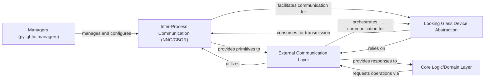

## Details

Abstract Components Overview of a Blender Add-on

### Inter-Process Communication (NNG/CBOR) [[Expand]](./Inter_Process_Communication_NNG_CBOR_.md)
This is the core component responsible for low-level inter-process communication. It leverages NNG (Nanomsg Next Generation) for robust messaging and CBOR (Concise Binary Object Representation) for efficient data serialization and Remote Procedure Calls (RPC). It ensures reliable and efficient data exchange with external services.

**Related Classes/Methods**:

- `AmberLG.lib.pylightio.external.cbor.cbor_rpc_client`
- <a href="https://github.com/transcental/AmberLG/blob/master/lib/pylightio/external/cbor/tagmap.py" target="_blank" rel="noopener noreferrer">`AmberLG.lib.pylightio.external.cbor.tagmap`</a>

### External Communication Layer
This component provides a higher-level abstraction over the raw IPC mechanisms, simplifying interactions with external services. It orchestrates the use of NNG/CBOR for various communication needs, abstracting away the complexities of message framing, serialization, and network handling.

**Related Classes/Methods**:

- `AmberLG.lib.pylightio.external.cbor.CborService`

### Looking Glass Device Abstraction
This component is responsible for managing and abstracting interactions with Looking Glass hardware and services. It translates application-level requests into commands and data suitable for the Looking Glass ecosystem, often relying on the underlying IPC mechanisms for communication with the HoloPlay Service or other device-specific processes.

**Related Classes/Methods**:

- `AmberLG.lib.pylightio.lookingglass.LookingGlassDevice`

### Core Logic/Domain Layer
This layer contains the primary business logic and data models of the Blender Add-on. It defines how the application processes data, manages scenes, and generates outputs (e.g., quilts for holographic display). It initiates requests for external services and processes responses, often indirectly through the External Communication Layer.

**Related Classes/Methods**:

- <a href="https://github.com/transcental/AmberLG/blob/master/lightfield_viewport.py" target="_blank" rel="noopener noreferrer">`AmberLG.lightfield_viewport`</a>
- <a href="https://github.com/transcental/AmberLG/blob/master/lightfield_render.py" target="_blank" rel="noopener noreferrer">`AmberLG.lightfield_render`</a>
- `AmberLG.camera_manager`
- `AmberLG.quilt_generator`

### Managers (pylightio.managers)
This component provides various management functionalities within the `pylightio` library. It may handle the lifecycle of connections, resource allocation, or state management related to external interactions, potentially configuring and overseeing the use of IPC channels.

**Related Classes/Methods**:

- `AmberLG.lib.pylightio.managers.ServiceManager`

### [FAQ](https://github.com/CodeBoarding/GeneratedOnBoardings/tree/main?tab=readme-ov-file#faq)