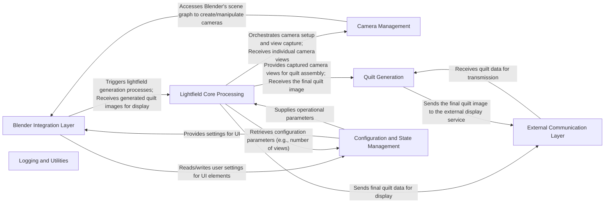

## Details

Abstract Components Overview

### Blender Integration Layer
Manages the add-on's user interface, operators, and direct interactions with the Blender API. It acts as the primary bridge between Blender's environment and the core lightfield logic, handling user input and displaying results within Blender.

**Related Classes/Methods**:

- <a href="https://github.com/transcental/AmberLG/blob/master/__init__.py#L1-L1" target="_blank" rel="noopener noreferrer">`__init__` (1:1)</a>
- <a href="https://github.com/transcental/AmberLG/blob/master/lightfield_viewport.py#L1-L1" target="_blank" rel="noopener noreferrer">`lightfield_viewport` (1:1)</a>
- <a href="https://github.com/transcental/AmberLG/blob/master/lightfield_render.py#L1-L1" target="_blank" rel="noopener noreferrer">`lightfield_render` (1:1)</a>

### Lightfield Core Processing [[Expand]](./Lightfield_Core_Processing.md)
Encapsulates the fundamental algorithms and data processing required to generate lightfield data. It orchestrates the entire lightfield creation pipeline, including camera management and quilt image synthesis, serving as the independent core domain logic.

**Related Classes/Methods**:

### Camera Management
A specialized sub-component of Lightfield Core Processing, responsible for configuring, positioning, and managing virtual cameras within Blender to capture the necessary lightfield views. It handles the creation and manipulation of camera arrays.

**Related Classes/Methods**:

### Quilt Generation
A specialized sub-component of Lightfield Core Processing, dedicated to processing the individual camera views captured by the Camera Management component and synthesizing them into a single "quilt" image suitable for holographic displays.

**Related Classes/Methods**:

### External Communication Layer
Abstracts the complexities of inter-process communication and data exchange with external services (e.g., Looking Glass Bridge, HoloPlay Service). It handles data serialization (e.g., CBOR) and network protocols to send lightfield data to the display.

**Related Classes/Methods**:

### Configuration and State Management
Manages the add-on's persistent settings, user preferences, and global runtime state. It ensures proper serialization, storage, and retrieval of configuration data, allowing users to customize the add-on's behavior.

**Related Classes/Methods**:

- <a href="https://github.com/transcental/AmberLG/blob/master/globals.py#L1-L1" target="_blank" rel="noopener noreferrer">`globals` (1:1)</a>

### Logging and Utilities
Provides common utility functions and a centralized logging mechanism for debugging, error reporting, and general helper functionalities used across various components of the add-on.

**Related Classes/Methods**:

- <a href="https://github.com/transcental/AmberLG/blob/master/logs/__init__.py#L1-L1" target="_blank" rel="noopener noreferrer">`logs.__init__` (1:1)</a>

### [FAQ](https://github.com/CodeBoarding/GeneratedOnBoardings/tree/main?tab=readme-ov-file#faq)