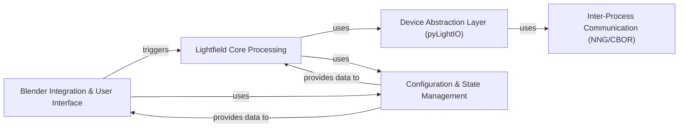

## Details

The AmberLG add-on for Blender follows a modular architecture designed for integrating holographic displays.

### Blender Integration & User Interface [[Expand]](./Blender_Integration_User_Interface.md)
This component serves as the primary interface between the Blender environment and the add-on's core logic. It manages all user-facing elements, including custom panels, operators, viewport drawing for lightfield visualization, and integration with Blender's rendering pipeline and preference system.

**Related Classes/Methods**:

- `AmberLG.ui`
- <a href="https://github.com/transcental/AmberLG/blob/master/lightfield_viewport.py" target="_blank" rel="noopener noreferrer">`AmberLG.lightfield_viewport`</a>
- <a href="https://github.com/transcental/AmberLG/blob/master/lightfield_render.py" target="_blank" rel="noopener noreferrer">`AmberLG.lightfield_render`</a>
- `AmberLG.preferences`
- <a href="https://github.com/transcental/AmberLG/blob/master/__init__.py" target="_blank" rel="noopener noreferrer">`AmberLG.__init__`</a>

### Lightfield Core Processing [[Expand]](./Lightfield_Core_Processing.md)
This component encapsulates the fundamental algorithms and data processing required to generate lightfield data. It is responsible for managing camera arrays, calculating lightfield views, and preparing the final "quilt" image suitable for holographic displays. This layer is designed to be independent of Blender's specific UI.

**Related Classes/Methods**:

- `AmberLG.camera_manager`
- `AmberLG.quilt_generator`

### Device Abstraction Layer (pyLightIO) [[Expand]](./Device_Abstraction_Layer_pyLightIO_.md)
This component provides a high-level, abstract interface for interacting with external holographic display devices and services. It abstracts away the complexities of device-specific communication protocols and hardware interactions, offering a unified API for sending lightfield data.

**Related Classes/Methods**:

- `AmberLG.lib.pylightio`
- `AmberLG.lib.pylightio.lookingglass`
- `AmberLG.lib.pylightio.managers`

### Inter-Process Communication (NNG/CBOR) [[Expand]](./Inter_Process_Communication_NNG_CBOR_.md)
This component handles the low-level inter-process communication (IPC) mechanisms used to exchange data with external services, specifically leveraging NNG (Nanomsg Next Generation) for messaging and CBOR (Concise Binary Object Representation) for data serialization and RPC. It ensures robust and efficient data transfer.

**Related Classes/Methods**:

- `AmberLG.lib.pylightio.external.cbor`
- `AmberLG.lib.pylightio.external.cbor.cbor_rpc_client`
- <a href="https://github.com/transcental/AmberLG/blob/master/lib/pylightio/external/cbor/tagmap.py" target="_blank" rel="noopener noreferrer">`AmberLG.lib.pylightio.external.cbor.tagmap`</a>

### Configuration & State Management [[Expand]](./Configuration_State_Management.md)
This component centralizes the management of application-wide settings, user preferences, and global variables. It ensures that configuration data is consistently stored, loaded, and accessible across different parts of the add-on, facilitating persistence and shared state.

**Related Classes/Methods**:

- <a href="https://github.com/transcental/AmberLG/blob/master/globals.py" target="_blank" rel="noopener noreferrer">`AmberLG.globals`</a>
- `AmberLG.preferences`

### [FAQ](https://github.com/CodeBoarding/GeneratedOnBoardings/tree/main?tab=readme-ov-file#faq)