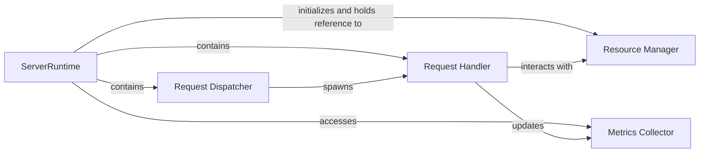

## Details

The `Backend Service` subsystem simulates a server's operational behavior, resource consumption, and performance. It is a critical part of the simulation, modeling how requests are processed and how server resources are utilized.

### ServerRuntime
The primary class that orchestrates the simulation of a backend server. It manages the server's lifecycle, resource allocation, request processing, and state reporting. This component acts as the central hub for all server-specific simulation logic.

**Related Classes/Methods**:

- <a href="https://github.com/AsyncFlow-Sim/AsyncFlow/blob/main/src/asyncflow/runtime/actors/server.py#L29-L290" target="_blank" rel="noopener noreferrer">`ServerRuntime`:29-290</a>

### Request Dispatcher
An internal mechanism within `ServerRuntime` responsible for continuously monitoring the server's inbox for new requests. Upon receiving a request, it initiates a dedicated process for its handling.

**Related Classes/Methods**:

- <a href="https://github.com/AsyncFlow-Sim/AsyncFlow/blob/main/src/asyncflow/runtime/actors/server.py" target="_blank" rel="noopener noreferrer">`ServerRuntime:_dispatcher`</a>

### Request Handler
The core logic unit that simulates the processing of an individual request within the server. It models the consumption of CPU and RAM resources and introduces delays for both CPU-bound and I/O-bound operations.

**Related Classes/Methods**:

- <a href="https://github.com/AsyncFlow-Sim/AsyncFlow/blob/main/src/asyncflow/runtime/actors/server.py" target="_blank" rel="noopener noreferrer">`ServerRuntime:_handle_request`</a>

### Resource Manager
Manages the server's available CPU and RAM resources, ensuring that requests acquire and release them appropriately during their processing. This is implemented using SimPy's resource mechanisms.

**Related Classes/Methods**:

- <a href="https://github.com/AsyncFlow-Sim/AsyncFlow/blob/main/src/asyncflow/resources/server_containers.py#L22-L31" target="_blank" rel="noopener noreferrer">`ServerContainers`:22-31</a>

### Metrics Collector
Responsible for collecting and exposing various performance metrics related to the server's operation, such as the length of the ready queue, I/O queue, and total RAM in use.

**Related Classes/Methods**:

- <a href="https://github.com/AsyncFlow-Sim/AsyncFlow/blob/main/src/asyncflow/metrics/server.py#L21-L34" target="_blank" rel="noopener noreferrer">`build_server_metrics`:21-34</a>

### [FAQ](https://github.com/CodeBoarding/GeneratedOnBoardings/tree/main?tab=readme-ov-file#faq)