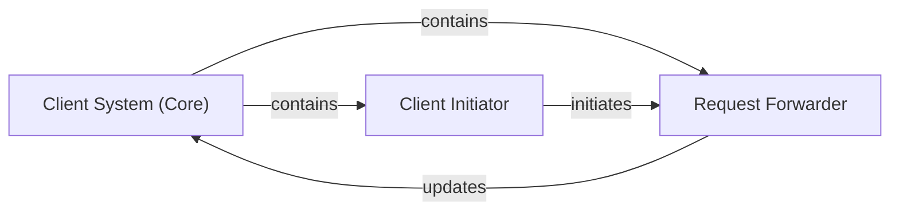

## Details

The Client Subsystem is designed to simulate client behavior within a distributed system. At its core, the `Client System (Core)` manages the entire lifecycle of requests, from generation to completion tracking. The `Client Initiator` component serves as the activation point, starting the request forwarding process. This process is handled by the `Request Forwarder`, an internal mechanism of the `Client System (Core)`, which is responsible for dispatching requests and processing their responses, subsequently updating the `Client System (Core)` with the latest request status. This architecture ensures a clear separation of concerns for client simulation, initiation, and request-response handling, providing a robust framework for workload generation and tracking.

### Client System (Core)
The primary component representing client entities. It is responsible for simulating client behavior, including generating requests, injecting them into the simulated distributed system, and tracking their complete lifecycle from start to finish. It acts as the interface between the workload generation and the simulated network.

**Related Classes/Methods**:

- <a href="https://github.com/AsyncFlow-Sim/AsyncFlow/blob/main/src/asyncflow/runtime/actors/client.py#L18-L83" target="_blank" rel="noopener noreferrer">`asyncflow.runtime.actors.client.ClientRuntime`:18-83</a>

### Request Forwarder
An internal mechanism within the `Client System` responsible for the actual dispatching of generated requests into the network and processing their return upon completion. It differentiates between the initial sending of requests and the handling of responses.

**Related Classes/Methods**:

- <a href="https://github.com/AsyncFlow-Sim/AsyncFlow/blob/main/src/asyncflow/runtime/actors/client.py" target="_blank" rel="noopener noreferrer">`asyncflow.runtime.actors.client.ClientRuntime._forwarder`</a>

### Client Initiator
This component is responsible for activating the operational logic of the `Client System`. Specifically, it starts the request forwarding process within the simulation environment, effectively beginning the client's active role in generating and dispatching requests.

**Related Classes/Methods**:

- <a href="https://github.com/AsyncFlow-Sim/AsyncFlow/blob/main/src/asyncflow/runtime/actors/client.py" target="_blank" rel="noopener noreferrer">`asyncflow.runtime.actors.client.ClientRuntime.start`</a>

### [FAQ](https://github.com/CodeBoarding/GeneratedOnBoardings/tree/main?tab=readme-ov-file#faq)