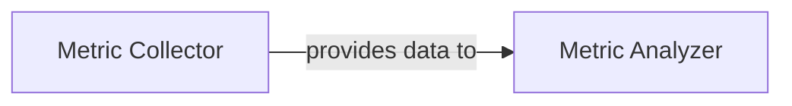

## Details

The `Metrics & Reporting` subsystem is crucial for understanding the performance and behavior of the simulated distributed system. It encompasses two primary components: the `Metric Collector` for data acquisition and the `Metric Analyzer` for data processing, analysis, and visualization.

### Metric Collector
This component is responsible for initiating and managing the collection of raw performance and resource utilization metrics from various simulation components. It tracks the state of requests and builds time-series data throughout the simulation run, serving as the fundamental data acquisition layer.

**Related Classes/Methods**:

- <a href="https://github.com/AsyncFlow-Sim/AsyncFlow/blob/main/src/asyncflow/runtime/simulation_runner.py#L253-L260" target="_blank" rel="noopener noreferrer">`collector`:253-260</a>
- <a href="https://github.com/AsyncFlow-Sim/AsyncFlow/blob/main/src/asyncflow/runtime/simulation_runner.py" target="_blank" rel="noopener noreferrer">`simulation_runner`</a>

### Metric Analyzer
This component processes the raw metrics collected by the `Metric Collector` to calculate derived performance statistics such as latency, throughput, queue lengths, and resource utilization. It then analyzes these processed metrics to derive insights into system performance, identify bottlenecks, and generates various visualizations (e.g., plots) to present the collected and analyzed data. It acts as the data processing, analysis, and presentation layer.

**Related Classes/Methods**:

- <a href="https://github.com/AsyncFlow-Sim/AsyncFlow/blob/main/src/asyncflow/metrics/analyzer.py#L36-L589" target="_blank" rel="noopener noreferrer">`analyzer`:36-589</a>

### [FAQ](https://github.com/CodeBoarding/GeneratedOnBoardings/tree/main?tab=readme-ov-file#faq)