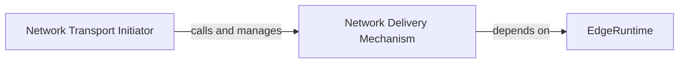

## Details

The `Network Layer` subsystem is crucial for simulating communication channels within the `AsyncFlow` project, a `Simulation Library/Tool`. It models the transfer of requests between different simulated actors, incorporating realistic network characteristics like latency and bandwidth constraints.

### EdgeRuntime
This is the foundational component of the Network Layer, representing a single, unidirectional communication link. It encapsulates the core logic for simulating network characteristics such as latency, dropout rates, and managing concurrent connections. It acts as the primary building block for all network interactions within the simulation.

**Related Classes/Methods**:

- <a href="https://github.com/AsyncFlow-Sim/AsyncFlow/blob/main/src/asyncflow/runtime/actors/edge.py#L27-L102" target="_blank" rel="noopener noreferrer">`EdgeRuntime`:27-102</a>

### Network Transport Initiator
This component serves as the external interface for sending `RequestState` objects across the simulated network link. It is responsible for initiating the asynchronous process of a request's journey through the network, preparing it for delivery.

**Related Classes/Methods**:

- <a href="https://github.com/AsyncFlow-Sim/AsyncFlow/blob/main/src/asyncflow/runtime/actors/edge.py" target="_blank" rel="noopener noreferrer">`EdgeRuntime:transport`</a>

### Network Delivery Mechanism
This component contains the core simulation logic for the actual transmission and delivery of a request over the network link. It calculates simulated latency, checks for potential request dropouts, and ultimately places the processed request into the destination actor's inbox.

**Related Classes/Methods**:

- <a href="https://github.com/AsyncFlow-Sim/AsyncFlow/blob/main/src/asyncflow/runtime/actors/edge.py" target="_blank" rel="noopener noreferrer">`EdgeRuntime:_deliver`</a>

### [FAQ](https://github.com/CodeBoarding/GeneratedOnBoardings/tree/main?tab=readme-ov-file#faq)