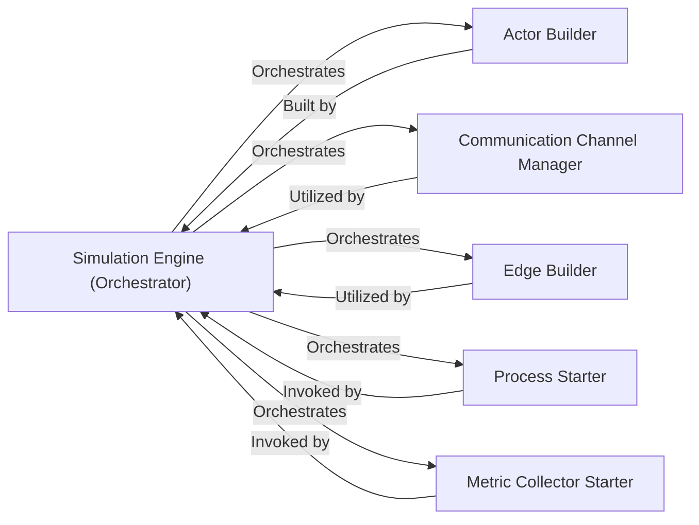

## Details

The `Simulation Engine` subsystem is the core orchestrator of the simulation, responsible for building, wiring, and starting all simulation actors, managing the simulation clock, and initiating the metric collection process. It drives the overall simulation lifecycle.

### Simulation Engine (Orchestrator)
The central orchestrator of the simulation, responsible for managing the entire simulation lifecycle. This includes coordinating the building and configuration of all simulation actors, establishing communication channels and network topology, initiating the execution of all simulation processes, and starting the metric collection mechanisms. It acts as the primary entry point for running a simulation.

**Related Classes/Methods**:

- <a href="https://github.com/AsyncFlow-Sim/AsyncFlow/blob/main/src/asyncflow/runtime/simulation_runner.py#L43-L310" target="_blank" rel="noopener noreferrer">`asyncflow.runtime.simulation_runner.SimulationRunner`:43-310</a>

### Actor Builder
Responsible for instantiating and configuring various simulation actors such as clients, servers, load balancers, and request generators based on the simulation's configuration. It translates configuration details into concrete simulation entities.

**Related Classes/Methods**:

- <a href="https://github.com/AsyncFlow-Sim/AsyncFlow/blob/main/src/asyncflow/runtime/simulation_runner.py" target="_blank" rel="noopener noreferrer">`asyncflow.runtime.simulation_runner.SimulationRunner:_build_client`</a>
- <a href="https://github.com/AsyncFlow-Sim/AsyncFlow/blob/main/src/asyncflow/runtime/simulation_runner.py" target="_blank" rel="noopener noreferrer">`asyncflow.runtime.simulation_runner.SimulationRunner:_build_load_balancer`</a>
- <a href="https://github.com/AsyncFlow-Sim/AsyncFlow/blob/main/src/asyncflow/runtime/simulation_runner.py" target="_blank" rel="noopener noreferrer">`asyncflow.runtime.simulation_runner.SimulationRunner:_build_servers`</a>
- <a href="https://github.com/AsyncFlow-Sim/AsyncFlow/blob/main/src/asyncflow/runtime/simulation_runner.py" target="_blank" rel="noopener noreferrer">`asyncflow.runtime.simulation_runner.SimulationRunner:_build_rqs_generator`</a>

### Communication Channel Manager
Manages the creation and configuration of inboxes or message queues that facilitate inter-actor communication within the simulated environment, enabling the "Interconnected Components" aspect of the architecture.

**Related Classes/Methods**:

- <a href="https://github.com/AsyncFlow-Sim/AsyncFlow/blob/main/src/asyncflow/runtime/simulation_runner.py" target="_blank" rel="noopener noreferrer">`asyncflow.runtime.simulation_runner.SimulationRunner:_make_inbox`</a>

### Edge Builder
Establishes the network topology and defines the connections (edges) between different simulation actors, determining how requests and messages flow through the system. This is vital for simulating distributed system interactions.

**Related Classes/Methods**:

- <a href="https://github.com/AsyncFlow-Sim/AsyncFlow/blob/main/src/asyncflow/runtime/simulation_runner.py" target="_blank" rel="noopener noreferrer">`asyncflow.runtime.simulation_runner.SimulationRunner:_build_edges`</a>

### Process Starter
Initiates and manages the execution of all individual simulation processes (e.g., client request generation, server processing, load balancer routing) within the SimPy discrete event simulation environment.

**Related Classes/Methods**:

- <a href="https://github.com/AsyncFlow-Sim/AsyncFlow/blob/main/src/asyncflow/runtime/simulation_runner.py" target="_blank" rel="noopener noreferrer">`asyncflow.runtime.simulation_runner.SimulationRunner:_start_all_processes`</a>

### Metric Collector Starter
Activates and configures the mechanisms responsible for collecting various performance and operational metrics throughout the simulation run, enabling the "Observability" aspect of the architecture.

**Related Classes/Methods**:

- <a href="https://github.com/AsyncFlow-Sim/AsyncFlow/blob/main/src/asyncflow/runtime/simulation_runner.py" target="_blank" rel="noopener noreferrer">`asyncflow.runtime.simulation_runner.SimulationRunner:_start_metric_collector`</a>

### [FAQ](https://github.com/CodeBoarding/GeneratedOnBoardings/tree/main?tab=readme-ov-file#faq)