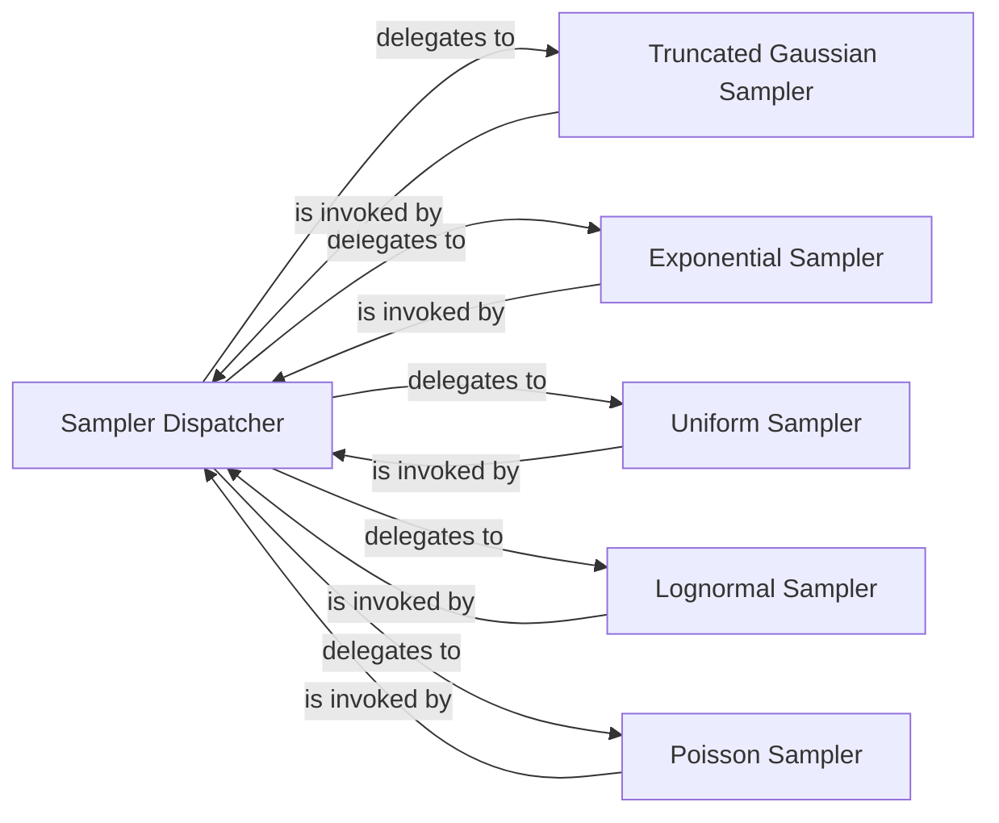

## Details

The `asyncflow.samplers` subsystem is designed to provide a flexible and extensible mechanism for generating random variables with various statistical distributions. The central component, the `Sampler Dispatcher`, implemented by the `general_sampler` function, serves as a unified interface for all random variable generation requests. It abstracts the complexity of selecting and invoking specific distribution generators by accepting a configuration object (`RVConfig`). Based on this configuration, the `Sampler Dispatcher` dynamically delegates the actual random number generation to specialized components such as the `Truncated Gaussian Sampler`, `Exponential Sampler`, `Uniform Sampler`, `Lognormal Sampler`, and `Poisson Sampler`. Each of these specialized components is responsible for generating random numbers according to its specific distribution, ensuring accurate and efficient simulation modeling. This modular design facilitates the easy integration of new distribution types without requiring modifications to the core dispatching logic, thereby enhancing the system's maintainability and scalability.

### Sampler Dispatcher
Acts as the central entry point and unified interface for all random variable generation requests. It abstracts the complexity of selecting and invoking specific distribution generators, providing a clean API for the rest of the simulation system.

**Related Classes/Methods**:

- <a href="https://github.com/AsyncFlow-Sim/AsyncFlow/blob/main/src/asyncflow/samplers/common_helpers.py#L49-L89" target="_blank" rel="noopener noreferrer">`asyncflow.samplers.common_helpers.general_sampler`:49-89</a>

### Truncated Gaussian Sampler
Specializes in generating random numbers that follow a truncated Gaussian distribution, allowing for the modeling of variables with defined upper and lower bounds, crucial for realistic simulations where values cannot be infinite.

**Related Classes/Methods**:

- <a href="https://github.com/AsyncFlow-Sim/AsyncFlow/blob/main/src/asyncflow/samplers/common_helpers.py#L22-L32" target="_blank" rel="noopener noreferrer">`asyncflow.samplers.common_helpers.truncated_gaussian_generator`:22-32</a>

### Exponential Sampler
Responsible for generating random numbers according to an exponential distribution, which is widely used in discrete-event simulations to model inter-arrival times of requests or service durations due to its memoryless property.

**Related Classes/Methods**:

- <a href="https://github.com/AsyncFlow-Sim/AsyncFlow/blob/main/src/asyncflow/samplers/common_helpers.py#L42-L47" target="_blank" rel="noopener noreferrer">`asyncflow.samplers.common_helpers.exponential_variable_generator`:42-47</a>

### Uniform Sampler
Generates random numbers from a uniform distribution, suitable for scenarios where every outcome within a specified range has an equal probability, useful for simple, unbiased random selections or durations.

**Related Classes/Methods**:

- <a href="https://github.com/AsyncFlow-Sim/AsyncFlow/blob/main/src/asyncflow/samplers/common_helpers.py#L10-L13" target="_blank" rel="noopener noreferrer">`asyncflow.samplers.common_helpers.uniform_variable_generator`:10-13</a>

### Lognormal Sampler
Provides random numbers following a log-normal distribution, frequently employed to model positively skewed quantities such as task execution times, file sizes, or network latencies, which are common in distributed systems.

**Related Classes/Methods**:

- <a href="https://github.com/AsyncFlow-Sim/AsyncFlow/blob/main/src/asyncflow/samplers/common_helpers.py#L34-L40" target="_blank" rel="noopener noreferrer">`asyncflow.samplers.common_helpers.lognormal_variable_generator`:34-40</a>

### Poisson Sampler
Generates random numbers based on a Poisson distribution, primarily used for modeling the number of events occurring within a fixed interval of time or space, such as the number of requests arriving per second.

**Related Classes/Methods**:

- <a href="https://github.com/AsyncFlow-Sim/AsyncFlow/blob/main/src/asyncflow/samplers/common_helpers.py#L15-L20" target="_blank" rel="noopener noreferrer">`asyncflow.samplers.common_helpers.poisson_variable_generator`:15-20</a>

### [FAQ](https://github.com/CodeBoarding/GeneratedOnBoardings/tree/main?tab=readme-ov-file#faq)