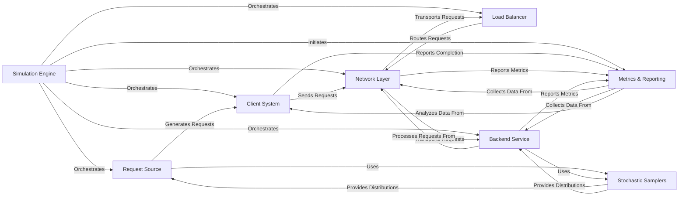

## Details

The AsyncFlow simulation framework is orchestrated by the **Simulation Engine**, which sets up and manages all simulation actors. The simulation begins with the **Request Source** generating requests, utilizing **Stochastic Samplers** for realistic variability, and passing them to the **Client System**. The Client System then sends these requests into the simulated environment via the **Network Layer**. Requests traverse the Network Layer to reach the **Load Balancer**, which, based on its strategy, routes them back through the Network Layer to an appropriate **Backend Service**. Backend Services process these requests, also leveraging Stochastic Samplers for processing time variability, and report their operational metrics. Throughout this process, the **Metrics & Reporting** component collects performance and resource utilization data from the Client System, Network Layer, and Backend Services, providing comprehensive insights into the simulated system's behavior. This architecture effectively models a distributed system's request flow, load balancing, and service processing, with a strong emphasis on data collection for analysis.

### Simulation Engine [[Expand]](./Simulation_Engine.md)
The core orchestrator of the simulation. It is responsible for building, wiring, and starting all simulation actors, managing the simulation clock, and initiating the metric collection process. It drives the overall simulation lifecycle.

**Related Classes/Methods**:

- <a href="https://github.com/AsyncFlow-Sim/AsyncFlow/blob/main/src/asyncflow/runtime/simulation_runner.py" target="_blank" rel="noopener noreferrer">`Simulation Engine`</a>

### Request Source
Generates simulated requests according to defined patterns (e.g., inter-arrival times, request types). It acts as the entry point for workload into the simulated system.

**Related Classes/Methods**:

- <a href="https://github.com/AsyncFlow-Sim/AsyncFlow/blob/main/src/asyncflow/runtime/actors/rqs_generator.py" target="_blank" rel="noopener noreferrer">`Request Source`</a>

### Client System [[Expand]](./Client_System.md)
Represents client entities that send generated requests into the simulated distributed system and track their lifecycle (start and finish times). It acts as the origin point for requests entering the network.

**Related Classes/Methods**:

- <a href="https://github.com/AsyncFlow-Sim/AsyncFlow/blob/main/src/asyncflow/runtime/actors/client.py" target="_blank" rel="noopener noreferrer">`Client System`</a>

### Network Layer [[Expand]](./Network_Layer.md)
Models the communication channels between different actors, introducing simulated network latency and potentially bandwidth constraints. It facilitates request transfer between components.

**Related Classes/Methods**:

- <a href="https://github.com/AsyncFlow-Sim/AsyncFlow/blob/main/src/asyncflow/runtime/actors/edge.py" target="_blank" rel="noopener noreferrer">`Network Layer`</a>

### Load Balancer [[Expand]](./Load_Balancer.md)
Distributes incoming requests from the Network Layer to a pool of available Backend Services based on a defined load balancing strategy.

**Related Classes/Methods**:

- <a href="https://github.com/AsyncFlow-Sim/AsyncFlow/blob/main/src/asyncflow/runtime/actors/load_balancer.py" target="_blank" rel="noopener noreferrer">`Load Balancer`</a>

### Backend Service [[Expand]](./Backend_Service.md)
Simulates a backend server that processes requests, consuming resources (e.g., CPU, RAM) and introducing service time delays. It reports its internal state and performance metrics.

**Related Classes/Methods**:

- <a href="https://github.com/AsyncFlow-Sim/AsyncFlow/blob/main/src/asyncflow/runtime/actors/server.py" target="_blank" rel="noopener noreferrer">`Backend Service`</a>

### Stochastic Samplers [[Expand]](./Stochastic_Samplers.md)
Provides various statistical distributions for generating random variables, crucial for simulating stochastic processes like request inter-arrival times, service durations, and network latencies.

**Related Classes/Methods**:

- <a href="https://github.com/AsyncFlow-Sim/AsyncFlow/blob/main/src/asyncflow/samplers/common_helpers.py" target="_blank" rel="noopener noreferrer">`Stochastic Samplers`</a>

### Metrics & Reporting [[Expand]](./Metrics_Reporting.md)
Gathers raw performance and resource utilization metrics from various simulation components, tracks request state, and processes, analyzes, and visualizes the collected simulation metrics to derive insights into system performance.

**Related Classes/Methods**:

- <a href="https://github.com/AsyncFlow-Sim/AsyncFlow/blob/main/src/asyncflow/metrics/collector.py" target="_blank" rel="noopener noreferrer">`Metrics & Reporting`</a>
- <a href="https://github.com/AsyncFlow-Sim/AsyncFlow/blob/main/src/asyncflow/metrics/analyzer.py" target="_blank" rel="noopener noreferrer">`Metrics & Reporting`</a>

### [FAQ](https://github.com/CodeBoarding/GeneratedOnBoardings/tree/main?tab=readme-ov-file#faq)