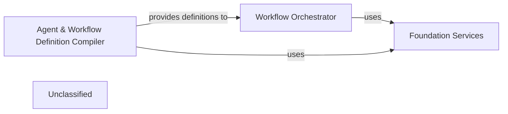

## Details

The `Agent & Workflow Orchestration Core` subsystem is the central control unit for managing the lifecycle, execution flow, and state of agents and workflows within the `AutoAgent` project. It interprets definitions, orchestrates execution, and manages internal state, aligning with the project's LLM Agent Framework and Orchestration Pattern.

### Foundation Services
This component provides fundamental services, shared utilities, ably base classes or configurations that are leveraged across the entire orchestration process. It acts as a foundational layer, ensuring consistency and providing common functionalities for both agent and workflow management.

**Related Classes/Methods**:

- <a href="https://github.com/HKUDS/AutoAgent/blob/main/autoagent/core.py" target="_blank" rel="noopener noreferrer">`autoagent.core`</a>

### Workflow Orchestrator
Responsible for interpreting workflow definitions, managing the sequential or conditional execution flow between different agents or steps, handling state transitions, and orchestrating data exchange. It is the primary driver for executing defined workflows according to their logic.

**Related Classes/Methods**:

- <a href="https://github.com/HKUDS/AutoAgent/blob/main/autoagent/flow/core.py" target="_blank" rel="noopener noreferrer">`autoagent.flow.core`</a>

### Agent & Workflow Definition Compiler
Handles the definition, parsing, and compilation of meta-agents and their associated forms (e.g., `form_complie`, `worklow_form_complie`). This component translates high-level, declarative descriptions of agents and workflows into an executable or interpretable format, supporting how agents are structured and interact within workflows.

**Related Classes/Methods**:

- <a href="https://github.com/HKUDS/AutoAgent/blob/main/autoagent/agents/meta_agent/form_complie.py" target="_blank" rel="noopener noreferrer">`autoagent.agents.meta_agent.form_complie`</a>
- <a href="https://github.com/HKUDS/AutoAgent/blob/main/autoagent/agents/meta_agent/worklow_form_complie.py" target="_blank" rel="noopener noreferrer">`autoagent.agents.meta_agent.worklow_form_complie`</a>

### Unclassified
Component for all unclassified files and utility functions (Utility functions/External Libraries/Dependencies)

**Related Classes/Methods**: _None_

### [FAQ](https://github.com/CodeBoarding/GeneratedOnBoardings/tree/main?tab=readme-ov-file#faq)