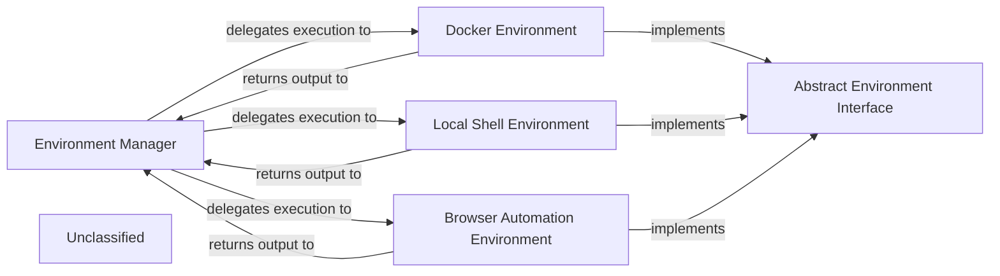

## Details

The `autoagent.environment` subsystem is responsible for managing and orchestrating various execution environments for tools. It provides a flexible mechanism for running code in isolated or specific contexts, such as Docker containers, the local shell, or a web browser. The conceptual Environment Manager acts as the central orchestrator, delegating execution requests to specialized environment components such as the Docker Environment, Local Shell Environment, and Browser Automation Environment. These specific environments implicitly adhere to an Abstract Environment Interface, ensuring consistent interaction patterns. This design allows for the seamless integration of diverse execution contexts, enabling the agent to perform a wide range of tasks from sandboxed code execution to web automation. The primary interaction pathway involves the Environment Manager delegating tasks to a specific environment and receiving the execution results back, forming a clear request-response cycle.

### Environment Manager
This central component orchestrates the execution of tools across different environments. It receives requests, selects the appropriate environment, delegates execution, and collects results. Its functionality is distributed across the `autoagent.environment` package, with `autoagent.environment.tcp_server.TCPServer` potentially acting as a key part of its interaction mechanism.

**Related Classes/Methods**:

- <a href="https://github.com/HKUDS/AutoAgent/blob/main/autoagent/environment/tcp_server.py#L1-L100" target="_blank" rel="noopener noreferrer">`autoagent.environment.tcp_server.TCPServer`:1-100</a>

### Abstract Environment Interface
Defines a common interface for all specific execution environments. This ensures consistency in how different environments are managed and interacted with.

**Related Classes/Methods**:

- <a href="https://github.com/HKUDS/AutoAgent/blob/main/autoagent/environment/docker_env.py" target="_blank" rel="noopener noreferrer">`autoagent.environment.docker_env.DockerEnvironment`</a>
- <a href="https://github.com/HKUDS/AutoAgent/blob/main/autoagent/environment/local_env.py" target="_blank" rel="noopener noreferrer">`autoagent.environment.local_env.LocalEnvironment`</a>
- <a href="https://github.com/HKUDS/AutoAgent/blob/main/autoagent/environment/browser_env.py" target="_blank" rel="noopener noreferrer">`autoagent.environment.browser_env.BrowserEnvironment`</a>

### Docker Environment
Manages the execution of tools within isolated Docker containers, providing a sandboxed environment for untrusted code or specific dependencies.

**Related Classes/Methods**:

- <a href="https://github.com/HKUDS/AutoAgent/blob/main/autoagent/environment/docker_env.py#L1-L100" target="_blank" rel="noopener noreferrer">`autoagent.environment.docker_env.DockerEnvironment`:1-100</a>

### Local Shell Environment
Provides direct access to the local system's shell for executing commands, suitable for tools requiring interaction with the host operating system.

**Related Classes/Methods**:

- <a href="https://github.com/HKUDS/AutoAgent/blob/main/autoagent/environment/local_env.py#L1-L100" target="_blank" rel="noopener noreferrer">`autoagent.environment.local_env.LocalEnvironment`:1-100</a>

### Browser Automation Environment
Manages browser instances to automate web-based tasks, enabling interaction with web applications.

**Related Classes/Methods**:

- <a href="https://github.com/HKUDS/AutoAgent/blob/main/autoagent/environment/browser_env.py#L1-L100" target="_blank" rel="noopener noreferrer">`autoagent.environment.browser_env.BrowserEnvironment`:1-100</a>

### Unclassified
Component for all unclassified files and utility functions (Utility functions/External Libraries/Dependencies)

**Related Classes/Methods**: _None_

### [FAQ](https://github.com/CodeBoarding/GeneratedOnBoardings/tree/main?tab=readme-ov-file#faq)