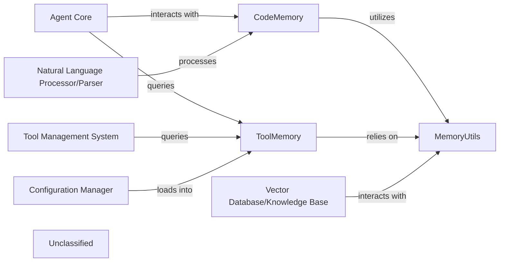

## Details

The `autoagent.memory` subsystem is a critical component for an intelligent agent system, providing specialized memory management for programmatic and tool-related information. It consists of `CodeMemory` for storing and retrieving code snippets, `ToolMemory` for maintaining a registry of available tools and their functionalities, and `MemoryUtils` which offers foundational memory operations, including integration with an external `Vector Database/Knowledge Base` for efficient data retrieval. This subsystem is designed to be highly interactive, serving as a central knowledge hub for core agent functionalities. Key external components such as the `Agent Core` leverage `CodeMemory` and `ToolMemory` for decision-making and tool utilization, while the `Natural Language Processor/Parser` processes code-related information from `CodeMemory`. The `Tool Management System` relies on `ToolMemory` for tool orchestration, and the `Configuration Manager` populates `ToolMemory` with essential tool definitions, ensuring a dynamic and extensible agent environment.

### CodeMemory
Manages the storage, retrieval, and processing of code snippets. This includes code generated by agents, code examples for learning, or code relevant to specific tasks. It acts as a specialized knowledge base for programmatic information, enabling agents to recall and utilize code effectively.

**Related Classes/Methods**:

- <a href="https://github.com/HKUDS/AutoAgent/blob/main/autoagent/memory/code_memory.py" target="_blank" rel="noopener noreferrer">`autoagent.memory.code_memory`</a>

### ToolMemory
Serves as a registry and knowledge base for all tools available to the agents. It stores tool definitions, functionalities, input/output schemas, and potentially usage statistics or examples, enabling agents to dynamically discover and utilize tools. This component is vital for the extensibility and dynamic capabilities of the agent system.

**Related Classes/Methods**:

- <a href="https://github.com/HKUDS/AutoAgent/blob/main/autoagent/memory/tool_memory.py" target="_blank" rel="noopener noreferrer">`autoagent.memory.tool_memory`</a>

### MemoryUtils
Provides a set of common functionalities and abstractions for managing memory across different memory types. This includes data serialization/deserialization, indexing, retrieval mechanisms (e.g., integration with a vector database for semantic search), and potentially memory compression or summarization techniques. It acts as a foundational layer for memory operations, abstracting the underlying storage mechanisms.

**Related Classes/Methods**:

- <a href="https://github.com/HKUDS/AutoAgent/blob/main/autoagent/memory/utils.py" target="_blank" rel="noopener noreferrer">`autoagent.memory.utils`</a>

### Agent Core
The central orchestrator of the agent system, responsible for decision-making, task execution, and managing the overall flow. It interacts with various memory components to retrieve and store information necessary for its operations.

**Related Classes/Methods**:

### Natural Language Processor/Parser
Responsible for understanding and processing natural language inputs and outputs. It extracts meaningful information, potentially from code-related text stored in `CodeMemory`, to facilitate agent reasoning and interaction.

**Related Classes/Methods**:

### Tool Management System [[Expand]](./Tool_Management_System.md)
Manages the lifecycle and invocation of tools available to the agent. It queries `ToolMemory` to discover available tools, understand their capabilities, and execute them as needed.

**Related Classes/Methods**:

- `Tool Management System`

### Configuration Manager
Handles the loading and management of system configurations, including tool definitions and settings. It loads this configuration data into `ToolMemory` to make tools available to the agent system.

**Related Classes/Methods**:

### Vector Database/Knowledge Base
An external data store utilized by `MemoryUtils` for efficient semantic search and retrieval of information. It provides the underlying storage and indexing capabilities for advanced memory operations.

**Related Classes/Methods**:

### Unclassified
Component for all unclassified files and utility functions (Utility functions/External Libraries/Dependencies)

**Related Classes/Methods**: _None_

### [FAQ](https://github.com/CodeBoarding/GeneratedOnBoardings/tree/main?tab=readme-ov-file#faq)