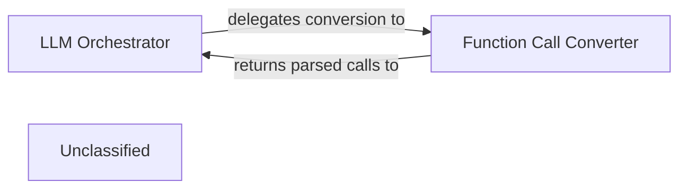

## Details

The LLM Integration & Communication subsystem manages the abstraction, communication, and standardization of interactions with various Large Language Models within the AutoAgent framework. The main flow involves the LLM Orchestrator handling high-level LLM interactions, delegating function call formatting and parsing to the Function Call Converter. Its purpose is to enable seamless and standardized communication with different LLM providers.

### LLM Orchestrator
This component acts as the central orchestrator for all LLM interactions. It manages the high-level logic for sending prompts to various LLMs, receiving their responses, and potentially maintaining the state of ongoing LLM conversations. It serves as the primary interface for other parts of the AutoAgent framework to communicate with the underlying LLM providers.

**Related Classes/Methods**:

- <a href="https://github.com/HKUDS/AutoAgent/blob/main/autoagent/core.py" target="_blank" rel="noopener noreferrer">`autoagent.core`</a>

### Function Call Converter
This component is responsible for standardizing the communication of function calls with LLMs. It handles the conversion of internal representations of function calls (e.g., Python function signatures and arguments) into the specific formats required by different LLM providers (e.g., OpenAI function calling, Gemini tool calling). Conversely, it parses LLM-generated function call instructions back into an executable format for the agent.

**Related Classes/Methods**:

- <a href="https://github.com/HKUDS/AutoAgent/blob/main/autoagent/fn_call_converter.py" target="_blank" rel="noopener noreferrer">`autoagent.fn_call_converter`</a>

### Unclassified
Component for all unclassified files and utility functions (Utility functions/External Libraries/Dependencies)

**Related Classes/Methods**: _None_

### [FAQ](https://github.com/CodeBoarding/GeneratedOnBoardings/tree/main?tab=readme-ov-file#faq)