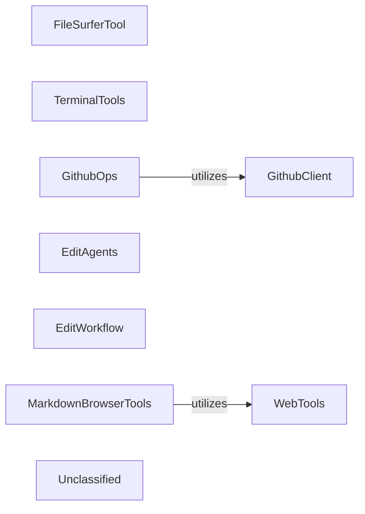

## Details

The `AutoAgent` system leverages a set of specialized tools to enable agents to interact with various environments. `FileSurferTool` provides local file system access, while `WebTools` handles general web interactions. For more specific tasks, `TerminalTools` allows direct command execution. GitHub operations are abstracted by `GithubOps`, which in turn utilizes the `GithubClient` for low-level API calls. Meta-programming capabilities are provided by `EditAgents` for managing agent configurations and `EditWorkflow` for orchestrating multi-agent processes. Finally, `MarkdownBrowserTools` facilitates web content browsing with integrated markdown processing, internally using `MdConvert` for its conversion needs. This modular design allows agents to perform a wide range of tasks by combining these distinct capabilities.

### FileSurferTool
Provides agents with capabilities to interact with the local file system, including reading, writing, listing, and navigating directories. This is crucial for agents needing to inspect or modify code, data, or configuration files.

**Related Classes/Methods**:

- <a href="https://github.com/HKUDS/AutoAgent/blob/main/autoagent/tools/file_surfer_tool.py" target="_blank" rel="noopener noreferrer">`autoagent.tools.file_surfer_tool.FileSurferTool`</a>

### WebTools
Offers general-purpose web interaction functionalities, enabling agents to make HTTP requests, fetch web content, and interact with online services. Essential for agents requiring external data or API access.

**Related Classes/Methods**:

- <a href="https://github.com/HKUDS/AutoAgent/blob/main/autoagent/tools/web_tools.py" target="_blank" rel="noopener noreferrer">`autoagent.tools.web_tools.WebTools`</a>

### TerminalTools
Allows agents to execute shell commands and interact directly with the underlying operating system's terminal environment. This is vital for automation tasks, running scripts, or managing system processes.

**Related Classes/Methods**:

- <a href="https://github.com/HKUDS/AutoAgent/blob/main/autoagent/tools/terminal_tools.py" target="_blank" rel="noopener noreferrer">`autoagent.tools.terminal_tools.TerminalTools`</a>

### GithubOps
Provides high-level, abstracted operations for interacting with GitHub repositories, such as creating pull requests, managing issues, or cloning repositories. It simplifies complex GitHub workflows for agents.

**Related Classes/Methods**:

- <a href="https://github.com/HKUDS/AutoAgent/blob/main/autoagent/tools/github_ops.py" target="_blank" rel="noopener noreferrer">`autoagent.tools.github_ops.GithubOps`</a>

### GithubClient
A dedicated client responsible for authenticating and making raw, low-level API calls to the GitHub API. It serves as the foundational layer for all GitHub interactions.

**Related Classes/Methods**:

- <a href="https://github.com/HKUDS/AutoAgent/blob/main/autoagent/tools/github_client.py#L6-L66" target="_blank" rel="noopener noreferrer">`autoagent.tools.github_client.GithubClient`:6-66</a>

### EditAgents
A meta-tool that empowers agents to introspect, create, modify, or manage the configurations and definitions of other agents within the system. This is key for self-modifying or self-managing agent systems.

**Related Classes/Methods**:

- <a href="https://github.com/HKUDS/AutoAgent/blob/main/autoagent/tools/meta/edit_agents.py" target="_blank" rel="noopener noreferrer">`autoagent.tools.meta.edit_agents.EditAgents`</a>

### EditWorkflow
A meta-tool enabling agents to define, modify, or orchestrate complex multi-agent workflows. It allows agents to dynamically adapt and manage their operational sequences.

**Related Classes/Methods**:

- <a href="https://github.com/HKUDS/AutoAgent/blob/main/autoagent/tools/meta/edit_workflow.py" target="_blank" rel="noopener noreferrer">`autoagent.tools.meta.edit_workflow.EditWorkflow`</a>

### MarkdownBrowserTools
Provides agents with capabilities for browsing web content, specifically designed to handle and render markdown from web sources. It internally utilizes `MdConvert` for processing and converting markdown content, making it essential for agents interacting with documentation or web pages rich in markdown.

**Related Classes/Methods**:

- <a href="https://github.com/HKUDS/AutoAgent/blob/main/autoagent/environment/markdown_browser/requests_markdown_browser.py#L25-L454" target="_blank" rel="noopener noreferrer">`autoagent.environment.markdown_browser.requests_markdown_browser.RequestsMarkdownBrowser`:25-454</a>
- <a href="https://github.com/HKUDS/AutoAgent/blob/main/autoagent/environment/mdconvert.py" target="_blank" rel="noopener noreferrer">`autoagent.environment.mdconvert.MdConvert`</a>

### Unclassified
Component for all unclassified files and utility functions (Utility functions/External Libraries/Dependencies)

**Related Classes/Methods**: _None_

### [FAQ](https://github.com/CodeBoarding/GeneratedOnBoardings/tree/main?tab=readme-ov-file#faq)