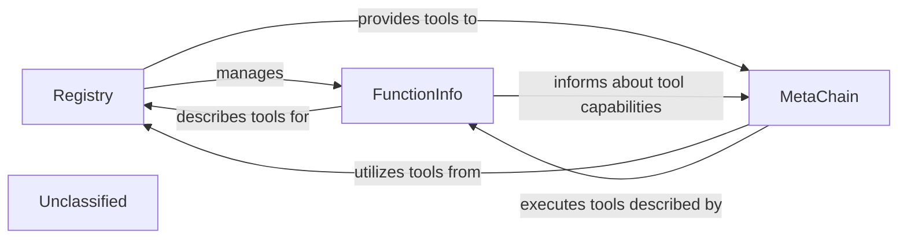

## Details

The Tool Management System subsystem is a critical part of the AutoAgent project, focusing on the lifecycle and invocation of various tools, agents, and workflows. It embodies the plugin/extensible architecture pattern by providing a structured way to manage and utilize external functionalities.

### Registry
The central repository and manager for all tools, agents, and workflows. It handles the registration process, stores metadata, and facilitates the discovery of available functionalities. This component is fundamental for the extensibility and modularity of the agent framework.

**Related Classes/Methods**:

- <a href="https://github.com/HKUDS/AutoAgent/blob/main/autoagent/registry.py" target="_blank" rel="noopener noreferrer">`autoagent.registry.Registry`</a>

### FunctionInfo
A data structure that encapsulates the detailed metadata for each registered function (tool, agent, or workflow). It provides a standardized format for describing a function's purpose, parameters, and return types, enabling both the Registry and MetaChain to understand and interact with it effectively.

**Related Classes/Methods**:

- <a href="https://github.com/HKUDS/AutoAgent/blob/main/autoagent/registry.py#L26-L47" target="_blank" rel="noopener noreferrer">`autoagent.registry.FunctionInfo`:26-47</a>

### MetaChain
The orchestration engine responsible for integrating LLMs with agents and dynamically invoking registered tools. Within the Tool Management System, it acts as the execution layer, querying the Registry for tool information and executing the selected tools based on the LLM's directives.

**Related Classes/Methods**:

- <a href="https://github.com/HKUDS/AutoAgent/blob/main/autoagent/core.py#L96-L673" target="_blank" rel="noopener noreferrer">`autoagent.core.MetaChain`:96-673</a>

### Unclassified
Component for all unclassified files and utility functions (Utility functions/External Libraries/Dependencies)

**Related Classes/Methods**: _None_

### [FAQ](https://github.com/CodeBoarding/GeneratedOnBoardings/tree/main?tab=readme-ov-file#faq)