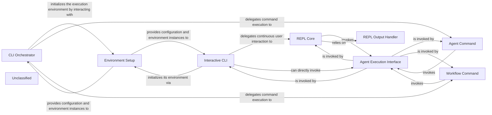

## Details

The User Interface (CLI & REPL) subsystem handles command-line interface operations, environment setup, and interactive user sessions. It provides the fundamental execution interface for agents, acting as the bridge between the UI and the agent runtime, and implements an interactive Read-Eval-Print Loop for continuous agent interaction and response display. Its purpose is to allow users to interact with and manage agents and workflows through both direct commands and persistent interactive sessions.

### CLI Orchestrator
The top-level command-line interface orchestrator, leveraging the `click` library to define and manage all available CLI commands. It serves as the primary entry point for user interaction via the command line.

**Related Classes/Methods**:

- <a href="https://github.com/HKUDS/AutoAgent/blob/main/autoagent/cli.py#L46-L49" target="_blank" rel="noopener noreferrer">`autoagent.cli.cli`:46-49</a>

### Agent Command
A specific command-line interface component dedicated to initiating and managing the direct execution of individual agents.

**Related Classes/Methods**:

- <a href="https://github.com/HKUDS/AutoAgent/blob/main/autoagent/cli.py" target="_blank" rel="noopener noreferrer">`autoagent.cli.agent`</a>

### Workflow Command
A command-line interface component responsible for triggering and overseeing the execution of predefined agent workflows.

**Related Classes/Methods**:

- <a href="https://github.com/HKUDS/AutoAgent/blob/main/autoagent/cli.py#L86-L91" target="_blank" rel="noopener noreferrer">`autoagent.cli.workflow`:86-91</a>

### Interactive CLI
Manages the interactive main menu and continuous user sessions within the command-line interface, allowing for ongoing user input and agent interaction in a persistent session.

**Related Classes/Methods**:

- <a href="https://github.com/HKUDS/AutoAgent/blob/main/autoagent/cli.py#L179-L235" target="_blank" rel="noopener noreferrer">`autoagent.cli.main`:179-235</a>
- <a href="https://github.com/HKUDS/AutoAgent/blob/main/autoagent/cli.py#L238-L315" target="_blank" rel="noopener noreferrer">`autoagent.cli.user_mode`:238-315</a>

### REPL Core
The central Read-Eval-Print Loop (REPL) for interactive agent sessions, handling continuous user input, processing it with agents, and displaying the responses.

**Related Classes/Methods**:

- <a href="https://github.com/HKUDS/AutoAgent/blob/main/autoagent/repl/repl.py#L60-L87" target="_blank" rel="noopener noreferrer">`autoagent.repl.repl.run_demo_loop`:60-87</a>

### REPL Output Handler
Responsible for formatting and displaying agent messages and real-time streaming responses in a readable and user-friendly format within the REPL environment.

**Related Classes/Methods**:

- <a href="https://github.com/HKUDS/AutoAgent/blob/main/autoagent/repl/repl.py#L6-L34" target="_blank" rel="noopener noreferrer">`autoagent.repl.repl.process_and_print_streaming_response`:6-34</a>
- <a href="https://github.com/HKUDS/AutoAgent/blob/main/autoagent/repl/repl.py#L37-L57" target="_blank" rel="noopener noreferrer">`autoagent.repl.repl.pretty_print_messages`:37-57</a>

### Environment Setup
Manages the retrieval of environment configuration settings (e.g., Docker, ports) and the initialization of necessary execution environments (e.g., code, web, file) that agents operate within.

**Related Classes/Methods**:

- <a href="https://github.com/HKUDS/AutoAgent/blob/main/autoagent/cli.py#L109-L142" target="_blank" rel="noopener noreferrer">`autoagent.cli.get_config`:109-142</a>
- <a href="https://github.com/HKUDS/AutoAgent/blob/main/autoagent/cli.py" target="_blank" rel="noopener noreferrer">`autoagent.cli.create_environment_functions`</a>

### Agent Execution Interface
Provides the fundamental execution mechanisms for agents within the MetaChain, acting as the primary interface between the User Interface components and the underlying Agent Core/Runtime.

**Related Classes/Methods**:

- <a href="https://github.com/HKUDS/AutoAgent/blob/main/autoagent/main.py" target="_blank" rel="noopener noreferrer">`autoagent.main`</a>

### Unclassified
Component for all unclassified files and utility functions (Utility functions/External Libraries/Dependencies)

**Related Classes/Methods**: _None_

### [FAQ](https://github.com/CodeBoarding/GeneratedOnBoardings/tree/main?tab=readme-ov-file#faq)