```mermaid
graph LR
    User_Interface_CLI_REPL_["User Interface (CLI & REPL)"]
    Agent_Workflow_Orchestration_Core["Agent & Workflow Orchestration Core"]
    LLM_Integration_Communication["LLM Integration & Communication"]
    Tool_Management_System["Tool Management System"]
    Execution_Environment_Management["Execution Environment Management"]
    Knowledge_Memory_Store["Knowledge & Memory Store"]
    Tool_Library["Tool Library"]
    Unclassified["Unclassified"]
    User_Interface_CLI_REPL_ -- "Initiates and manages agent/workflow execution" --> Agent_Workflow_Orchestration_Core
    Agent_Workflow_Orchestration_Core -- "Sends prompts and receives LLM responses" --> LLM_Integration_Communication
    LLM_Integration_Communication -- "Returns LLM responses and function calls" --> Agent_Workflow_Orchestration_Core
    Agent_Workflow_Orchestration_Core -- "Invokes tools based on agent needs" --> Tool_Management_System
    Tool_Management_System -- "Requests suitable runtime environments for tools" --> Execution_Environment_Management
    Execution_Environment_Management -- "Provides execution context" --> Tool_Management_System
    Tool_Management_System -- "Discovers and loads specific tool implementations" --> Tool_Library
    Tool_Library -- "Provides tool functionality" --> Tool_Management_System
    Agent_Workflow_Orchestration_Core -- "Stores agent context and memory" --> Knowledge_Memory_Store
    Knowledge_Memory_Store -- "Retrieves agent context and memory" --> Agent_Workflow_Orchestration_Core
    Tool_Library -- "Modifies agent and workflow definitions" --> Agent_Workflow_Orchestration_Core
    click User_Interface_CLI_REPL_ href "https://github.com/CodeBoarding/GeneratedOnBoardings/blob/main/AutoAgent/User_Interface_CLI_REPL_.md" "Details"
    click Agent_Workflow_Orchestration_Core href "https://github.com/CodeBoarding/GeneratedOnBoardings/blob/main/AutoAgent/Agent_Workflow_Orchestration_Core.md" "Details"
    click LLM_Integration_Communication href "https://github.com/CodeBoarding/GeneratedOnBoardings/blob/main/AutoAgent/LLM_Integration_Communication.md" "Details"
    click Tool_Management_System href "https://github.com/CodeBoarding/GeneratedOnBoardings/blob/main/AutoAgent/Tool_Management_System.md" "Details"
    click Execution_Environment_Management href "https://github.com/CodeBoarding/GeneratedOnBoardings/blob/main/AutoAgent/Execution_Environment_Management.md" "Details"
    click Knowledge_Memory_Store href "https://github.com/CodeBoarding/GeneratedOnBoardings/blob/main/AutoAgent/Knowledge_Memory_Store.md" "Details"
    click Tool_Library href "https://github.com/CodeBoarding/GeneratedOnBoardings/blob/main/AutoAgent/Tool_Library.md" "Details"
```

## Details

The AutoAgent system is structured around a core orchestration engine that manages agents and workflows, interacting with external Large Language Models (LLMs) and a robust Tool Management System. User interaction is primarily handled through a CLI and REPL, which initiate and monitor agent execution. Agents leverage a Knowledge & Memory Store for persistent context and utilize various tools, which are executed within managed environments. This design promotes modularity, allowing for flexible integration of new LLMs, tools, and execution environments, while maintaining a clear separation of concerns for efficient development and scalability.

### User Interface (CLI & REPL) [[Expand]](./User_Interface_CLI_REPL_.md)
The primary entry point for users to interact with the AutoAgent system, managing and running agents and workflows via command-line and an interactive shell.

**Related Classes/Methods**:

- <a href="https://github.com/HKUDS/AutoAgent/blob/main/autoagent/cli.py" target="_blank" rel="noopener noreferrer">`autoagent.cli`</a>
- <a href="https://github.com/HKUDS/AutoAgent/blob/main/autoagent/main.py" target="_blank" rel="noopener noreferrer">`autoagent.main`</a>
- <a href="https://github.com/HKUDS/AutoAgent/blob/main/autoagent/repl/repl.py" target="_blank" rel="noopener noreferrer">`autoagent.repl.repl`</a>

### Agent & Workflow Orchestration Core [[Expand]](./Agent_Workflow_Orchestration_Core.md)
The central control unit responsible for managing the lifecycle, execution flow, and state of agents and workflows. It interprets definitions, orchestrates execution, and manages internal state.

**Related Classes/Methods**:

- <a href="https://github.com/HKUDS/AutoAgent/blob/main/autoagent/core.py" target="_blank" rel="noopener noreferrer">`autoagent.core`</a>
- <a href="https://github.com/HKUDS/AutoAgent/blob/main/autoagent/flow/core.py" target="_blank" rel="noopener noreferrer">`autoagent.flow.core`</a>
- <a href="https://github.com/HKUDS/AutoAgent/blob/main/autoagent/agents/meta_agent/form_complie.py" target="_blank" rel="noopener noreferrer">`autoagent.agents.meta_agent.form_complie`</a>
- <a href="https://github.com/HKUDS/AutoAgent/blob/main/autoagent/agents/meta_agent/worklow_form_complie.py" target="_blank" rel="noopener noreferrer">`autoagent.agents.meta_agent.worklow_form_complie`</a>

### LLM Integration & Communication [[Expand]](./LLM_Integration_Communication.md)
Abstracts communication with various Large Language Models, handling API calls, model-specific interactions, and converting messages to and from function call formats for consistent LLM interaction.

**Related Classes/Methods**:

- <a href="https://github.com/HKUDS/AutoAgent/blob/main/autoagent/core.py" target="_blank" rel="noopener noreferrer">`autoagent.core`</a>
- <a href="https://github.com/HKUDS/AutoAgent/blob/main/autoagent/fn_call_converter.py" target="_blank" rel="noopener noreferrer">`autoagent.fn_call_converter`</a>

### Tool Management System [[Expand]](./Tool_Management_System.md)
A central system for registering, discovering, and invoking all available tools. It acts as an interface between the Orchestration Core and the Tool Library, managing tool metadata and execution requests.

**Related Classes/Methods**:

- <a href="https://github.com/HKUDS/AutoAgent/blob/main/autoagent/registry.py" target="_blank" rel="noopener noreferrer">`autoagent.registry`</a>
- <a href="https://github.com/HKUDS/AutoAgent/blob/main/autoagent/core.py" target="_blank" rel="noopener noreferrer">`autoagent.core`</a>

### Execution Environment Management [[Expand]](./Execution_Environment_Management.md)
Manages and provides different execution contexts for tools, including Docker containers, local shell environments, and browser automation, ensuring tools run in appropriate and isolated environments.

**Related Classes/Methods**:

- <a href="https://github.com/HKUDS/AutoAgent/blob/main/autoagent/environment/docker_env.py" target="_blank" rel="noopener noreferrer">`autoagent.environment.docker_env`</a>
- <a href="https://github.com/HKUDS/AutoAgent/blob/main/autoagent/environment/local_env.py" target="_blank" rel="noopener noreferrer">`autoagent.environment.local_env`</a>
- <a href="https://github.com/HKUDS/AutoAgent/blob/main/autoagent/environment/browser_env.py" target="_blank" rel="noopener noreferrer">`autoagent.environment.browser_env`</a>

### Knowledge & Memory Store [[Expand]](./Knowledge_Memory_Store.md)
Handles the storage, retrieval, and processing of contextual information and agent memory, including code snippets, tool-related data, and conversational history, providing agents with persistent knowledge.

**Related Classes/Methods**:

- <a href="https://github.com/HKUDS/AutoAgent/blob/main/autoagent/memory/code_memory.py" target="_blank" rel="noopener noreferrer">`autoagent.memory.code_memory`</a>
- <a href="https://github.com/HKUDS/AutoAgent/blob/main/autoagent/memory/tool_memory.py" target="_blank" rel="noopener noreferrer">`autoagent.memory.tool_memory`</a>
- <a href="https://github.com/HKUDS/AutoAgent/blob/main/autoagent/memory/utils.py" target="_blank" rel="noopener noreferrer">`autoagent.memory.utils`</a>

### Tool Library [[Expand]](./Tool_Library.md)
A comprehensive collection of specific tool implementations (e.g., file system, web, GitHub, meta-agent editing) that agents can utilize, embodying the extensible nature of the framework.

**Related Classes/Methods**:

- <a href="https://github.com/HKUDS/AutoAgent/blob/main/autoagent/tools/file_surfer_tool.py" target="_blank" rel="noopener noreferrer">`autoagent.tools.file_surfer_tool`</a>
- <a href="https://github.com/HKUDS/AutoAgent/blob/main/autoagent/environment/markdown_browser/requests_markdown_browser.py" target="_blank" rel="noopener noreferrer">`autoagent.environment.markdown_browser.requests_markdown_browser`</a>
- <a href="https://github.com/HKUDS/AutoAgent/blob/main/autoagent/environment/mdconvert.py" target="_blank" rel="noopener noreferrer">`autoagent.environment.mdconvert`</a>
- <a href="https://github.com/HKUDS/AutoAgent/blob/main/autoagent/tools/web_tools.py" target="_blank" rel="noopener noreferrer">`autoagent.tools.web_tools`</a>
- <a href="https://github.com/HKUDS/AutoAgent/blob/main/autoagent/tools/terminal_tools.py" target="_blank" rel="noopener noreferrer">`autoagent.tools.terminal_tools`</a>
- <a href="https://github.com/HKUDS/AutoAgent/blob/main/autoagent/tools/github_ops.py" target="_blank" rel="noopener noreferrer">`autoagent.tools.github_ops`</a>
- <a href="https://github.com/HKUDS/AutoAgent/blob/main/autoagent/tools/github_client.py" target="_blank" rel="noopener noreferrer">`autoagent.tools.github_client`</a>
- <a href="https://github.com/HKUDS/AutoAgent/blob/main/autoagent/tools/meta/edit_agents.py" target="_blank" rel="noopener noreferrer">`autoagent.tools.meta.edit_agents`</a>
- <a href="https://github.com/HKUDS/AutoAgent/blob/main/autoagent/tools/meta/edit_workflow.py" target="_blank" rel="noopener noreferrer">`autoagent.tools.meta.edit_workflow`</a>

### Unclassified
Component for all unclassified files and utility functions (Utility functions/External Libraries/Dependencies)

**Related Classes/Methods**: _None_

### [FAQ](https://github.com/CodeBoarding/GeneratedOnBoardings/tree/main?tab=readme-ov-file#faq)