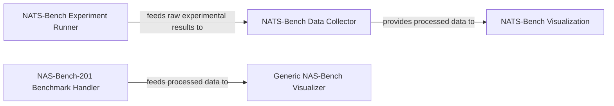

## Details

The project's core functionality revolves around benchmarking Neural Architecture Search (NAS) algorithms using the NAS-Bench-201 and NATS-Bench datasets. The `NAS-Bench-201 Benchmark Handler` manages the execution, data collection, and visualization for NAS-Bench-201. For NATS-Bench, the process is split: the `NATS-Bench Experiment Runner` initiates and manages experiments, feeding raw results to the `NATS-Bench Data Collector`. This collector then processes and simplifies the data, which is subsequently used by the `NATS-Bench Visualization` component to generate various plots and tables. A `Generic NAS-Bench Visualizer` provides a more generalized visualization capability, capable of consuming processed data from the `NAS-Bench-201 Benchmark Handler` for cross-benchmark analysis. This modular design ensures clear separation of concerns for experiment execution, data processing, and visualization across different NAS benchmarks.

### NAS-Bench-201 Benchmark Handler
This component orchestrates the entire lifecycle of interaction with the NAS-Bench-201 dataset. It handles the execution of evaluation procedures, collects raw experimental results, processes these results into meaningful statistics, and provides functionalities for visualizing performance metrics and insights. It acts as a self-contained unit for NAS-Bench-201 specific benchmarking.

**Related Classes/Methods**:

- <a href="https://github.com/D-X-Y/AutoDL-Projects/blob/main/exps/NAS-Bench-201/main.py" target="_blank" rel="noopener noreferrer">`main.py`</a>
- <a href="https://github.com/D-X-Y/AutoDL-Projects/blob/main/exps/NAS-Bench-201/statistics.py" target="_blank" rel="noopener noreferrer">`statistics.py`</a>
- <a href="https://github.com/D-X-Y/AutoDL-Projects/blob/main/exps/NAS-Bench-201/visualize.py" target="_blank" rel="noopener noreferrer">`visualize.py`</a>

### NATS-Bench Experiment Runner
This component serves as the primary entry point for initiating and managing evaluation processes across both the Size Search Space (SSS) and Topology Search Space (TSS) of NATS-Bench. It is responsible for setting up and running experiments, generating raw performance data for various architectures within the NATS-Bench framework.

**Related Classes/Methods**:

- <a href="https://github.com/D-X-Y/AutoDL-Projects/blob/main/exps/NATS-Bench/main-sss.py" target="_blank" rel="noopener noreferrer">`main-sss.py`</a>
- <a href="https://github.com/D-X-Y/AutoDL-Projects/blob/main/exps/NATS-Bench/main-tss.py" target="_blank" rel="noopener noreferrer">`main-tss.py`</a>

### NATS-Bench Data Collector
Dedicated to the NATS-Bench benchmark, this component manages the collection, processing, and simplification of statistical data obtained from both SSS and TSS evaluations. It transforms raw experimental outcomes into a structured format suitable for detailed analysis and subsequent visualization.

**Related Classes/Methods**:

- <a href="https://github.com/D-X-Y/AutoDL-Projects/blob/main/exps/NATS-Bench/sss-collect.py" target="_blank" rel="noopener noreferrer">`sss-collect.py`</a>
- <a href="https://github.com/D-X-Y/AutoDL-Projects/blob/main/exps/NATS-Bench/tss-collect.py" target="_blank" rel="noopener noreferrer">`tss-collect.py`</a>

### NATS-Bench Visualization
This component provides comprehensive functionalities for presenting NATS-Bench experimental outcomes. It includes specialized modules for generating various graphical visualizations (e.g., performance curves, rank correlations) and for structuring results in tabular formats, enabling clear interpretation of benchmark data.

**Related Classes/Methods**:

- <a href="https://github.com/D-X-Y/AutoDL-Projects/blob/main/exps/NATS-Bench/draw-correlations.py" target="_blank" rel="noopener noreferrer">`draw-correlations.py`</a>
- <a href="https://github.com/D-X-Y/AutoDL-Projects/blob/main/exps/NATS-Bench/draw-fig2_5.py" target="_blank" rel="noopener noreferrer">`draw-fig2_5.py`</a>
- <a href="https://github.com/D-X-Y/AutoDL-Projects/blob/main/exps/NATS-Bench/draw-fig6.py" target="_blank" rel="noopener noreferrer">`draw-fig6.py`</a>
- <a href="https://github.com/D-X-Y/AutoDL-Projects/blob/main/exps/NATS-Bench/draw-fig7.py" target="_blank" rel="noopener noreferrer">`draw-fig7.py`</a>
- <a href="https://github.com/D-X-Y/AutoDL-Projects/blob/main/exps/NATS-Bench/draw-fig8.py" target="_blank" rel="noopener noreferrer">`draw-fig8.py`</a>
- <a href="https://github.com/D-X-Y/AutoDL-Projects/blob/main/exps/NATS-Bench/draw-ranks.py" target="_blank" rel="noopener noreferrer">`draw-ranks.py`</a>
- <a href="https://github.com/D-X-Y/AutoDL-Projects/blob/main/exps/NATS-Bench/draw-table.py" target="_blank" rel="noopener noreferrer">`draw-table.py`</a>

### Generic NAS-Bench Visualizer
This component offers a flexible and experimental visualization utility designed to work across various NAS benchmarks. Its primary focus is on visualizing rank information and correlations, providing a generalized capability for comparing and analyzing different benchmark results beyond specific benchmark-tailored tools.

**Related Classes/Methods**:

- <a href="https://github.com/D-X-Y/AutoDL-Projects/blob/main/exps/experimental/visualize-nas-bench-x.py" target="_blank" rel="noopener noreferrer">`visualize-nas-bench-x.py`</a>

### [FAQ](https://github.com/CodeBoarding/GeneratedOnBoardings/tree/main?tab=readme-ov-file#faq)