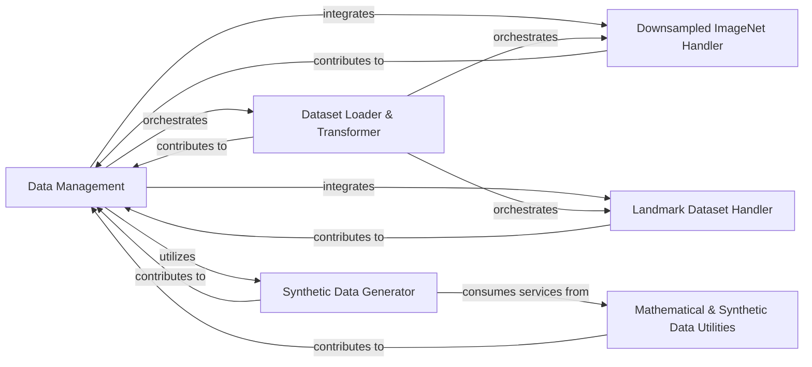

## Details

The feedback highlights missing FileRef for Downsampled ImageNet Handler and Landmark Dataset Handler, which has been addressed by identifying their respective file paths within the xautodl/datasets directory. This correction enhances the precision and verifiability of the analysis, making it more suitable for both documentation and diagram generation.

### Data Management [[Expand]](./Data_Management.md)
The overarching component responsible for orchestrating the entire data pipeline, from loading and preprocessing to augmentation and synthetic data generation. It provides a unified interface for accessing diverse data types, ensuring data readiness for various experiments, benchmarks, and model training.

**Related Classes/Methods**:

- <a href="https://github.com/D-X-Y/AutoDL-Projects/blob/main/xautodl/datasets/" target="_blank" rel="noopener noreferrer">`xautodl/datasets/`</a>

### Dataset Loader & Transformer
Acts as the primary interface for retrieving various datasets while applying specified data transformations (e.g., augmentation, normalization) on the fly. This component abstracts the data loading and preprocessing pipeline, aligning with the "preprocessing, and augmentation" aspect of data management.

**Related Classes/Methods**:

- <a href="https://github.com/D-X-Y/AutoDL-Projects/blob/main/xautodl/datasets/get_dataset_with_transform.py" target="_blank" rel="noopener noreferrer">`xautodl.datasets.get_dataset_with_transform`</a>

### Downsampled ImageNet Handler
Manages the loading, integrity verification, and access of downsampled image datasets (e.g., ImageNet). It ensures data consistency and readiness for use in experiments.

**Related Classes/Methods**:

- <a href="https://github.com/D-X-Y/AutoDL-Projects/blob/main/xautodl/datasets/DownsampledImageNet.py" target="_blank" rel="noopener noreferrer">`xautodl.datasets.downsampled_imagenet.DownsampledImageNet`</a>

### Landmark Dataset Handler
Specializes in handling landmark-based datasets, including their loading, internal state management (resetting), and item-wise processing.

**Related Classes/Methods**:

- <a href="https://github.com/D-X-Y/AutoDL-Projects/blob/main/xautodl/datasets/LandmarkDataset.py" target="_blank" rel="noopener noreferrer">`xautodl.datasets.landmark_dataset.LandmarkDataset`</a>

### Synthetic Data Generator
Facilitates the generation and manipulation of synthetic data sequences. This is crucial for controlled experiments, testing algorithms, or simulating environments where real data is scarce or complex, directly supporting the "generation of synthetic data" aspect.

**Related Classes/Methods**:

- <a href="https://github.com/D-X-Y/AutoDL-Projects/blob/main/xautodl/datasets/synthetic_env.py" target="_blank" rel="noopener noreferrer">`xautodl.datasets.synthetic_env`</a>

### Mathematical & Synthetic Data Utilities
This collection of modules provides foundational mathematical operations and utilities essential for the creation and manipulation of synthetic data. They serve as building blocks, primarily supporting the synthetic_env component.

**Related Classes/Methods**:

- <a href="https://github.com/D-X-Y/AutoDL-Projects/blob/main/xautodl/datasets/math_base_funcs.py" target="_blank" rel="noopener noreferrer">`xautodl.datasets.math_base_funcs`</a>
- <a href="https://github.com/D-X-Y/AutoDL-Projects/blob/main/xautodl/datasets/math_dynamic_generator.py" target="_blank" rel="noopener noreferrer">`xautodl.datasets.math_dynamic_generator`</a>
- <a href="https://github.com/D-X-Y/AutoDL-Projects/blob/main/xautodl/datasets/math_dynamic_funcs.py" target="_blank" rel="noopener noreferrer">`xautodl.datasets.math_dynamic_funcs`</a>
- <a href="https://github.com/D-X-Y/AutoDL-Projects/blob/main/xautodl/datasets/math_static_funcs.py" target="_blank" rel="noopener noreferrer">`xautodl.datasets.math_static_funcs`</a>
- <a href="https://github.com/D-X-Y/AutoDL-Projects/blob/main/xautodl/datasets/synthetic_utils.py" target="_blank" rel="noopener noreferrer">`xautodl.datasets.synthetic_utils`</a>

### [FAQ](https://github.com/CodeBoarding/GeneratedOnBoardings/tree/main?tab=readme-ov-file#faq)