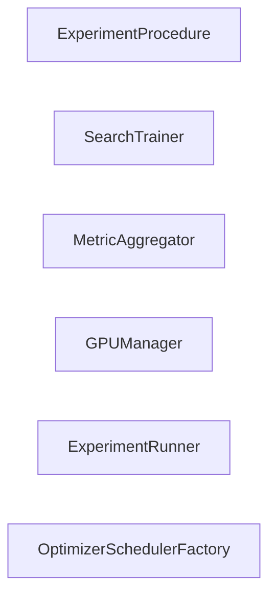

## Details

One paragraph explaining the functionality which is represented by this graph. What the main flow is and what is its purpose.

### ExperimentProcedure
Manages the overall experiment workflow.

**Related Classes/Methods**:

### SearchTrainer
Trains the search algorithm.

**Related Classes/Methods**:

### MetricAggregator
Aggregates and processes metrics.

**Related Classes/Methods**:

### GPUManager
Manages GPU resources.

**Related Classes/Methods**:

### ExperimentRunner
Executes experiments.

**Related Classes/Methods**:

### OptimizerSchedulerFactory
Factory for optimizer and scheduler.

**Related Classes/Methods**:

### [FAQ](https://github.com/CodeBoarding/GeneratedOnBoardings/tree/main?tab=readme-ov-file#faq)