```mermaid
graph LR
    xautodl_spaces_basic_space["xautodl.spaces.basic_space"]
    xautodl_xlayers_super_module["xautodl.xlayers.super_module"]
    xautodl_models_cell_operations["xautodl.models.cell_operations"]
    xautodl_models_cell_searchs_genotypes["xautodl.models.cell_searchs.genotypes"]
    xautodl_models_cell_searchs_generic_model["xautodl.models.cell_searchs.generic_model"]
    xautodl_models_shape_searchs["xautodl.models.shape_searchs"]
    xautodl_models___init__["xautodl.models.__init__"]
    xautodl_spaces_basic_space -- "Defines Parameters For" --> xautodl_xlayers_super_module
    xautodl_spaces_basic_space -- "Provides Search Space To" --> xautodl_models_cell_searchs_generic_model
    xautodl_xlayers_super_module -- "Configured By" --> xautodl_spaces_basic_space
    xautodl_models_cell_operations -- "Provides Primitives To" --> xautodl_models_cell_searchs_generic_model
    xautodl_models_cell_searchs_genotypes -- "Manages Architectures For" --> xautodl_models_cell_searchs_generic_model
    xautodl_models_cell_searchs_generic_model -- "Consumes Primitives From" --> xautodl_models_cell_operations
    xautodl_models_cell_searchs_generic_model -- "Utilizes Genotypes From" --> xautodl_models_cell_searchs_genotypes
    xautodl_models_shape_searchs -- "Accessed By" --> xautodl_models___init__
    xautodl_models___init__ -- "Provides Access To" --> xautodl_models_cell_searchs_generic_model
    xautodl_models___init__ -- "Provides Access To" --> xautodl_models_shape_searchs
```

## Details

This subsystem is responsible for defining the neural network models, including specialized structures for Neural Architecture Search (NAS) like supernets and cells, and specifying the possible architectural configurations or hyperparameter ranges for AutoML/NAS. It is crucial for defining "what can be searched" within the `xautodl` framework.

### xautodl.spaces.basic_space
This is the foundational element for defining and manipulating abstract search spaces. It allows for the definition of candidate values, determination of specific configurations, and generation of random or abstract architectural settings, directly addressing "what can be searched."

**Related Classes/Methods**:

- <a href="https://github.com/D-X-Y/AutoDL-Projects/blob/main/xautodl/spaces/basic_space.py#L1-L100" target="_blank" rel="noopener noreferrer">`xautodl.spaces.basic_space`:1-100</a>

### xautodl.xlayers.super_module
Serves as the abstract base class for all "super" layers within the `xautodl.xlayers` package. It provides common functionalities for creating flexible and searchable neural network modules, enabling dynamic architectural changes during NAS. This component embodies the modularity of searchable network components.

**Related Classes/Methods**:

- <a href="https://github.com/D-X-Y/AutoDL-Projects/blob/main/xautodl/xlayers/super_module.py#L1-L100" target="_blank" rel="noopener noreferrer">`xautodl.xlayers.super_module`:1-100</a>

### xautodl.models.cell_operations
Defines the fundamental, atomic operations (e.g., convolutions, pooling, skip connections) that constitute the building blocks of neural architecture search cells. These are the "primitives" from which complex architectures are composed, ensuring algorithm modularity.

**Related Classes/Methods**:

- <a href="https://github.com/D-X-Y/AutoDL-Projects/blob/main/xautodl/models/cell_operations.py#L1-L100" target="_blank" rel="noopener noreferrer">`xautodl.models.cell_operations`:1-100</a>

### xautodl.models.cell_searchs.genotypes
Manages the representation and manipulation of neural network genotypes (architectural structures). It provides functionalities to convert string representations to structured genotypes and to generate all possible architectural combinations, which is critical for defining the search space.

**Related Classes/Methods**:

- <a href="https://github.com/D-X-Y/AutoDL-Projects/blob/main/xautodl/models/cell_searchs/genotypes.py#L1-L100" target="_blank" rel="noopener noreferrer">`xautodl.models.cell_searchs.genotypes`:1-100</a>

### xautodl.models.cell_searchs.generic_model
Orchestrates neural architecture search over cells. It manages the forward pass for various search algorithms (e.g., GDAS, URS) and handles the conversion of architectural structures, effectively defining the supernet for cell-based NAS. This is a core component for the experimentation workflow.

**Related Classes/Methods**:

- <a href="https://github.com/D-X-Y/AutoDL-Projects/blob/main/xautodl/models/cell_searchs/generic_model.py#L1-L100" target="_blank" rel="noopener noreferrer">`xautodl.models.cell_searchs.generic_model`:1-100</a>

### xautodl.models.shape_searchs
Contains classes responsible for searching over high-level model shapes, such as network depth and width, rather than just cell operations. This provides a distinct dimension to the overall search space.

**Related Classes/Methods**:

- <a href="https://github.com/D-X-Y/AutoDL-Projects/blob/main/xautodl/models/shape_searchs#L1-L100" target="_blank" rel="noopener noreferrer">`xautodl.models.shape_searchs`:1-100</a>

### xautodl.models.__init__
Acts as a central factory and loader for various neural network models defined within the `xautodl.models` package, providing a unified interface for other components (e.g., experiment runners) to obtain model instances. This supports the modular design and configuration-driven execution.

**Related Classes/Methods**:

- <a href="https://github.com/D-X-Y/AutoDL-Projects/blob/main/xautodl/models/__init__.py#L1-L100" target="_blank" rel="noopener noreferrer">`xautodl.models.__init__`:1-100</a>

### [FAQ](https://github.com/CodeBoarding/GeneratedOnBoardings/tree/main?tab=readme-ov-file#faq)