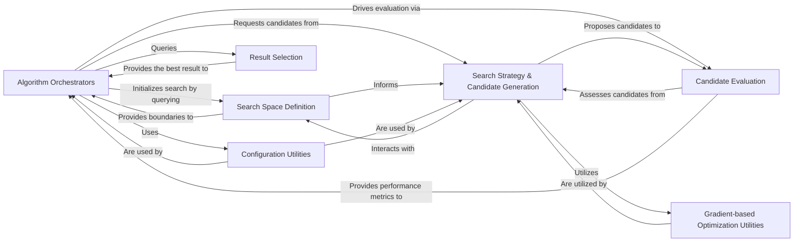

## Details

The `NAS/HPO Algorithms` subsystem is the core of the project, encapsulating the various search strategies and optimization techniques. Its architecture is designed for modularity and extensibility, allowing different algorithms to be plugged in and orchestrated for automated deep learning experimentation.

### Algorithm Orchestrators
These components serve as the entry points and high-level controllers for specific NAS/HPO algorithms. They initialize the search process, define the iterative search loop, and coordinate interactions between other components like candidate generation, evaluation, and result selection.

**Related Classes/Methods**:

- <a href="https://github.com/D-X-Y/AutoDL-Projects/blob/main/exps/NAS-Bench-201-algos/BOHB.py#L123-L259" target="_blank" rel="noopener noreferrer">`exps.NAS-Bench-201-algos.BOHB.main`:123-259</a>
- <a href="https://github.com/D-X-Y/AutoDL-Projects/blob/main/exps/NATS-algos/bohb.py#L96-L174" target="_blank" rel="noopener noreferrer">`exps.NATS-algos.bohb.main`:96-174</a>

### Search Space Definition
This component is responsible for formally defining the search domain for architectures or hyperparameters. It provides structured representations of the valid configurations that can be explored by the search algorithms.

**Related Classes/Methods**:

- <a href="https://github.com/D-X-Y/AutoDL-Projects/blob/main/exps/NAS-Bench-201-algos/BOHB.py#L29-L38" target="_blank" rel="noopener noreferrer">`get_configuration_space`:29-38</a>
- <a href="https://github.com/D-X-Y/AutoDL-Projects/blob/main/exps/NATS-algos/bohb.py#L41-L48" target="_blank" rel="noopener noreferrer">`get_size_config_space`:41-48</a>
- <a href="https://github.com/D-X-Y/AutoDL-Projects/blob/main/exps/NATS-algos/bohb.py#L29-L38" target="_blank" rel="noopener noreferrer">`get_topology_config_space`:29-38</a>

### Search Strategy & Candidate Generation
This central component implements the core search logic, including proposing new candidate architectures or hyperparameter configurations. For learning-based algorithms, it also encompasses the mechanisms for updating the internal model or policy that guides future candidate generation.

**Related Classes/Methods**:

- <a href="https://github.com/D-X-Y/AutoDL-Projects/blob/main/exps/NAS-Bench-201-algos/DARTS-V1.py#L26-L102" target="_blank" rel="noopener noreferrer">`search_func`:26-102</a>
- <a href="https://github.com/D-X-Y/AutoDL-Projects/blob/main/exps/NAS-Bench-201-algos/reinforce.py#L44-L53" target="_blank" rel="noopener noreferrer">`generate_arch`:44-53</a>
- <a href="https://github.com/D-X-Y/AutoDL-Projects/blob/main/exps/NAS-Bench-201-algos/R_EA.py#L115-L128" target="_blank" rel="noopener noreferrer">`random_architecture_func`:115-128</a>
- <a href="https://github.com/D-X-Y/AutoDL-Projects/blob/main/exps/NAS-Bench-201-algos/R_EA.py#L136-L146" target="_blank" rel="noopener noreferrer">`mutate_arch_func`:136-146</a>
- <a href="https://github.com/D-X-Y/AutoDL-Projects/blob/main/exps/NAS-Bench-201-algos/ENAS.py#L91-L200" target="_blank" rel="noopener noreferrer">`train_controller`:91-200</a>
- <a href="https://github.com/D-X-Y/AutoDL-Projects/blob/main/exps/NAS-Bench-201-algos/reinforce.py#L81-L85" target="_blank" rel="noopener noreferrer">`update`:81-85</a>
- <a href="https://github.com/D-X-Y/AutoDL-Projects/blob/main/exps/NAS-Bench-201-algos/reinforce.py#L92-L97" target="_blank" rel="noopener noreferrer">`select_action`:92-97</a>
- <a href="https://github.com/D-X-Y/AutoDL-Projects/blob/main/exps/NAS-Bench-201-algos/reinforce.py" target="_blank" rel="noopener noreferrer">`Policy`</a>

### Candidate Evaluation
This component is responsible for assessing the performance of generated candidates. It typically involves training and validating a model based on the proposed architecture or hyperparameters to obtain performance metrics.

**Related Classes/Methods**:

- <a href="https://github.com/D-X-Y/AutoDL-Projects/blob/main/exps/basic/basic-eval.py" target="_blank" rel="noopener noreferrer">`valid_func`</a>
- <a href="https://github.com/D-X-Y/AutoDL-Projects/blob/main/exps/NAS-Bench-201-algos/R_EA.py#L44-L112" target="_blank" rel="noopener noreferrer">`train_and_eval`:44-112</a>
- <a href="https://github.com/D-X-Y/AutoDL-Projects/blob/main/exps/NAS-Bench-201-algos/BOHB.py#L56-L120" target="_blank" rel="noopener noreferrer">`exps.NAS-Bench-201-algos.BOHB.MyWorker`:56-120</a>
- <a href="https://github.com/D-X-Y/AutoDL-Projects/blob/main/exps/NATS-algos/bohb.py#L77-L93" target="_blank" rel="noopener noreferrer">`exps.NATS-algos.bohb.MyWorker`:77-93</a>

### Configuration Utilities
This component handles the transformation and conversion between different representations of architectures or hyperparameters, ensuring compatibility across various stages of the search and evaluation process.

**Related Classes/Methods**:

- <a href="https://github.com/D-X-Y/AutoDL-Projects/blob/main/exps/NAS-Bench-201-algos/BOHB.py#L41-L53" target="_blank" rel="noopener noreferrer">`config2structure_func`:41-53</a>
- <a href="https://github.com/D-X-Y/AutoDL-Projects/blob/main/exps/NATS-algos/bohb.py#L66-L74" target="_blank" rel="noopener noreferrer">`config2size_func`:66-74</a>
- <a href="https://github.com/D-X-Y/AutoDL-Projects/blob/main/exps/NATS-algos/bohb.py#L51-L63" target="_blank" rel="noopener noreferrer">`config2topology_func`:51-63</a>

### Gradient-based Optimization Utilities
This component provides low-level mathematical operations and utilities specifically for differentiable NAS algorithms, enabling gradient-based optimization of the architecture search process.

**Related Classes/Methods**:

- <a href="https://github.com/D-X-Y/AutoDL-Projects/blob/main/exps/NAS-Bench-201-algos/DARTS-V2.py#L31-L49" target="_blank" rel="noopener noreferrer">`_hessian_vector_product`:31-49</a>
- <a href="https://github.com/D-X-Y/AutoDL-Projects/blob/main/exps/NAS-Bench-201-algos/DARTS-V2.py#L52-L113" target="_blank" rel="noopener noreferrer">`backward_step_unrolled`:52-113</a>

### Result Selection
This component is responsible for identifying and retrieving the most performant architecture or hyperparameter set discovered during the entire search process, based on the evaluation metrics.

**Related Classes/Methods**:

- <a href="https://github.com/D-X-Y/AutoDL-Projects/blob/main/exps/NAS-Bench-201-algos/ENAS.py#L203-L228" target="_blank" rel="noopener noreferrer">`get_best_arch`:203-228</a>
- <a href="https://github.com/D-X-Y/AutoDL-Projects/blob/main/exps/NAS-Bench-201-algos/RANDOM-NAS.py#L107-L131" target="_blank" rel="noopener noreferrer">`search_find_best`:107-131</a>

### [FAQ](https://github.com/CodeBoarding/GeneratedOnBoardings/tree/main?tab=readme-ov-file#faq)