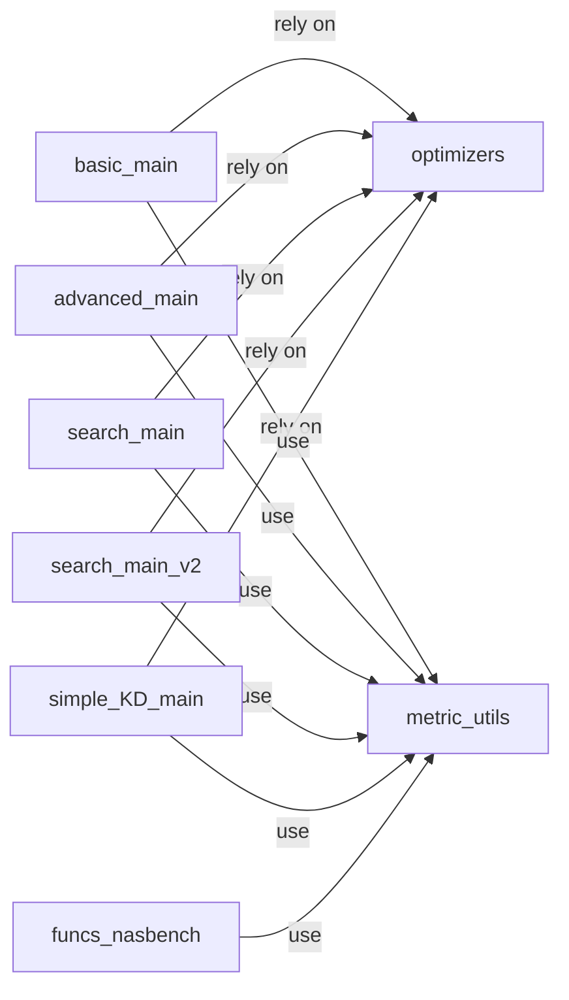

## Details

The `Training & Evaluation Engine` subsystem is primarily encapsulated within the `xautodl.procedures` package. This package contains the core logic for various training routines, optimization strategies, and performance metric calculations, forming the backbone of model learning and experimentation within the `xautodl` project.

### basic_main
Provides fundamental and straightforward training and validation routines, serving as a basic entry point for model training.

**Related Classes/Methods**:

- <a href="https://github.com/D-X-Y/AutoDL-Projects/blob/main/xautodl/procedures/basic_main.py" target="_blank" rel="noopener noreferrer">`xautodl.procedures.basic_main`</a>

### advanced_main
Implements advanced, often more complex, model training and evaluation loops, likely incorporating more sophisticated features or control flow than `basic_main`.

**Related Classes/Methods**:

- <a href="https://github.com/D-X-Y/AutoDL-Projects/blob/main/xautodl/procedures/advanced_main.py" target="_blank" rel="noopener noreferrer">`xautodl.procedures.advanced_main`</a>

### search_main
Contains training procedures specifically designed for Neural Architecture Search (NAS), often considering computational efficiency and search space exploration.

**Related Classes/Methods**:

- <a href="https://github.com/D-X-Y/AutoDL-Projects/blob/main/xautodl/procedures/search_main.py" target="_blank" rel="noopener noreferrer">`xautodl.procedures.search_main`</a>

### search_main_v2
An alternative or updated version of NAS-specific training procedures, potentially offering different search strategies or optimizations compared to `search_main`.

**Related Classes/Methods**:

- <a href="https://github.com/D-X-Y/AutoDL-Projects/blob/main/xautodl/procedures/search_main_v2.py" target="_blank" rel="noopener noreferrer">`xautodl.procedures.search_main_v2`</a>

### simple_KD_main
Implements training and validation routines tailored for Knowledge Distillation (KD), a model compression technique where a smaller model learns from a larger, pre-trained model.

**Related Classes/Methods**:

- <a href="https://github.com/D-X-Y/AutoDL-Projects/blob/main/xautodl/procedures/simple_KD_main.py" target="_blank" rel="noopener noreferrer">`xautodl.procedures.simple_KD_main`</a>

### optimizers
Manages the creation, configuration, and updating of optimization algorithms (e.g., SGD, Adam) and learning rate schedulers, which are crucial for guiding the model's learning process.

**Related Classes/Methods**:

- <a href="https://github.com/D-X-Y/AutoDL-Projects/blob/main/xautodl/procedures/optimizers.py" target="_blank" rel="noopener noreferrer">`xautodl.procedures.optimizers`</a>

### metric_utils
Handles the calculation, aggregation, and reporting of various performance metrics (e.g., accuracy, loss) during training and evaluation phases, providing insights into model performance.

**Related Classes/Methods**:

- <a href="https://github.com/D-X-Y/AutoDL-Projects/blob/main/xautodl/procedures/metric_utils.py" target="_blank" rel="noopener noreferrer">`xautodl.procedures.metric_utils`</a>

### funcs_nasbench
Provides specialized evaluation functions for benchmarking models against NAS-Bench datasets, enabling standardized performance comparison for NAS algorithms.

**Related Classes/Methods**:

- <a href="https://github.com/D-X-Y/AutoDL-Projects/blob/main/xautodl/procedures/funcs_nasbench.py" target="_blank" rel="noopener noreferrer">`xautodl.procedures.funcs_nasbench`</a>

### [FAQ](https://github.com/CodeBoarding/GeneratedOnBoardings/tree/main?tab=readme-ov-file#faq)