```mermaid
graph LR
    Experiment_Orchestrator["Experiment Orchestrator"]
    NAS_HPO_Algorithms["NAS/HPO Algorithms"]
    Model_Search_Space["Model & Search Space"]
    Data_Management["Data Management"]
    Training_Evaluation_Engine["Training & Evaluation Engine"]
    Benchmarking_Analysis["Benchmarking & Analysis"]
    Experiment_Orchestrator -- "orchestrates execution" --> NAS_HPO_Algorithms
    Experiment_Orchestrator -- "triggers training" --> Training_Evaluation_Engine
    Experiment_Orchestrator -- "submits results" --> Benchmarking_Analysis
    NAS_HPO_Algorithms -- "samples architectures" --> Model_Search_Space
    NAS_HPO_Algorithms -- "requests evaluation" --> Training_Evaluation_Engine
    Model_Search_Space -- "provides model definition" --> Training_Evaluation_Engine
    Data_Management -- "supplies data" --> Training_Evaluation_Engine
    Data_Management -- "supplies benchmark data" --> Benchmarking_Analysis
    Training_Evaluation_Engine -- "outputs metrics" --> Benchmarking_Analysis
    click Experiment_Orchestrator href "https://github.com/CodeBoarding/GeneratedOnBoardings/blob/main/AutoDL-Projects/Experiment_Orchestrator.md" "Details"
    click NAS_HPO_Algorithms href "https://github.com/CodeBoarding/GeneratedOnBoardings/blob/main/AutoDL-Projects/NAS_HPO_Algorithms.md" "Details"
    click Model_Search_Space href "https://github.com/CodeBoarding/GeneratedOnBoardings/blob/main/AutoDL-Projects/Model_Search_Space.md" "Details"
    click Data_Management href "https://github.com/CodeBoarding/GeneratedOnBoardings/blob/main/AutoDL-Projects/Data_Management.md" "Details"
    click Training_Evaluation_Engine href "https://github.com/CodeBoarding/GeneratedOnBoardings/blob/main/AutoDL-Projects/Training_Evaluation_Engine.md" "Details"
    click Benchmarking_Analysis href "https://github.com/CodeBoarding/GeneratedOnBoardings/blob/main/AutoDL-Projects/Benchmarking_Analysis.md" "Details"
```

## Details

The AutoDL-Projects framework is designed as a modular research toolkit for Automated Machine Learning (AutoML), specifically focusing on Neural Architecture Search (NAS) and Hyperparameter Optimization (HPO).

### Experiment Orchestrator [[Expand]](./Experiment_Orchestrator.md)
Manages the overall lifecycle of AutoML/NAS experiments, from setup to execution and result collection, driven by configurations. It serves as the central control plane.

**Related Classes/Methods**:

- <a href="https://github.com/D-X-Y/AutoDL-Projects/blob/main/exps/NAS-Bench-201/main.py" target="_blank" rel="noopener noreferrer">`exps/NAS-Bench-201/main.py`</a>
- <a href="https://github.com/D-X-Y/AutoDL-Projects/blob/main/exps/NATS-Bench/main-tss.py" target="_blank" rel="noopener noreferrer">`exps/NATS-Bench/main-tss.py`</a>
- <a href="https://github.com/D-X-Y/AutoDL-Projects/blob/main/exps/experimental/GeMOSA/main.py" target="_blank" rel="noopener noreferrer">`exps/experimental/GeMOSA/main.py`</a>
- <a href="https://github.com/D-X-Y/AutoDL-Projects/blob/main/xautodl/config_utils/config_utils.py" target="_blank" rel="noopener noreferrer">`xautodl/config_utils/config_utils.py`</a>

### NAS/HPO Algorithms [[Expand]](./NAS_HPO_Algorithms.md)
Encapsulates the core logic for various Neural Architecture Search and Hyperparameter Optimization algorithms, implementing the specific search strategies to find optimal architectures or hyperparameters.

**Related Classes/Methods**:

- <a href="https://github.com/D-X-Y/AutoDL-Projects/blob/main/exps/NAS-Bench-201-algos/" target="_blank" rel="noopener noreferrer">`exps/NAS-Bench-201-algos/`</a>
- <a href="https://github.com/D-X-Y/AutoDL-Projects/blob/main/exps/NATS-algos/" target="_blank" rel="noopener noreferrer">`exps/NATS-algos/`</a>

### Model & Search Space [[Expand]](./Model_Search_Space.md)
Defines neural network models, including specialized structures for NAS (e.g., supernets, cells), and specifies the possible architectural configurations or hyperparameter ranges for AutoML/NAS. This component is crucial for defining what can be searched.

**Related Classes/Methods**:

- <a href="https://github.com/D-X-Y/AutoDL-Projects/blob/main/xautodl/models/" target="_blank" rel="noopener noreferrer">`xautodl/models/`</a>
- <a href="https://github.com/D-X-Y/AutoDL-Projects/blob/main/xautodl/spaces/" target="_blank" rel="noopener noreferrer">`xautodl/spaces/`</a>
- <a href="https://github.com/D-X-Y/AutoDL-Projects/blob/main/xautodl/xlayers/" target="_blank" rel="noopener noreferrer">`xautodl/xlayers/`</a>

### Data Management [[Expand]](./Data_Management.md)
Handles the loading, preprocessing, and augmentation of datasets for training, validation, and evaluation across various experiments and benchmarks. It ensures data is prepared and accessible for the entire pipeline.

**Related Classes/Methods**:

- <a href="https://github.com/D-X-Y/AutoDL-Projects/blob/main/xautodl/datasets/" target="_blank" rel="noopener noreferrer">`xautodl/datasets/`</a>

### Training & Evaluation Engine [[Expand]](./Training_Evaluation_Engine.md)
Implements fundamental routines for model training, validation, and performance metric calculation. This includes optimizers, schedulers, and the core training loop, forming the backbone of model learning.

**Related Classes/Methods**:

- <a href="https://github.com/D-X-Y/AutoDL-Projects/blob/main/xautodl/procedures/" target="_blank" rel="noopener noreferrer">`xautodl/procedures/`</a>

### Benchmarking & Analysis [[Expand]](./Benchmarking_Analysis.md)
Provides tools for interacting with established NAS benchmarks (e.g., NAS-Bench-201, NATS-Bench), collecting statistics, and visualizing experimental results. This component is vital for comparing and understanding algorithm performance.

**Related Classes/Methods**:

- <a href="https://github.com/D-X-Y/AutoDL-Projects/blob/main/exps/NAS-Bench-201/" target="_blank" rel="noopener noreferrer">`exps/NAS-Bench-201/`</a>
- <a href="https://github.com/D-X-Y/AutoDL-Projects/blob/main/exps/NATS-Bench/" target="_blank" rel="noopener noreferrer">`exps/NATS-Bench/`</a>
- <a href="https://github.com/D-X-Y/AutoDL-Projects/blob/main/exps/experimental/visualize-nas-bench-x.py" target="_blank" rel="noopener noreferrer">`exps/experimental/visualize-nas-bench-x.py`</a>

### [FAQ](https://github.com/CodeBoarding/GeneratedOnBoardings/tree/main?tab=readme-ov-file#faq)