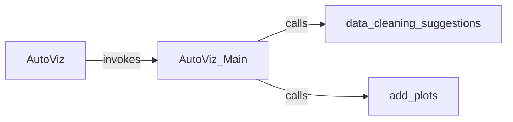

## Details

The AutoViz API & Orchestrator subsystem serves as the core interface and control mechanism for the AutoViz project, embodying the Facade and Pipeline/Workflow architectural patterns. It simplifies complex EDA and visualization tasks for users by orchestrating the entire data flow from ingestion to visualization.

### AutoViz
This component acts as the primary user-facing interface, providing a simplified, high-level API (AutoViz_Class.AutoViz method) for users to initiate the automated EDA and visualization process. It embodies the Facade Pattern, abstracting the underlying complexity of the visualization pipeline.

**Related Classes/Methods**:

- <a href="https://github.com/AutoViML/AutoViz/blob/master/autoviz/AutoViz_Class.py#L191-L242" target="_blank" rel="noopener noreferrer">`AutoViz_Class.AutoViz`:191-242</a>

### AutoViz_Main
The central control flow component that orchestrates the entire EDA and visualization pipeline. It coordinates the sequence of operations, including data preparation, cleaning suggestions, and plot generation. This aligns with the Pipeline/Workflow Pattern.

**Related Classes/Methods**:

- <a href="https://github.com/AutoViML/AutoViz/blob/master/autoviz/AutoViz_Class.py#L244-L541" target="_blank" rel="noopener noreferrer">`AutoViz_Class.AutoViz_Main`:244-541</a>

### data_cleaning_suggestions
Focuses on analyzing the input dataset to identify potential data quality issues and apply or suggest appropriate data cleaning operations. This component contributes to the "Data Preprocessing & Quality" aspect of the project.

**Related Classes/Methods**:

- <a href="https://github.com/AutoViML/AutoViz/blob/master/autoviz/AutoViz_Class.py#L596-L605" target="_blank" rel="noopener noreferrer">`AutoViz_Class.data_cleaning_suggestions`:596-605</a>

### add_plots
Responsible for generating various types of plots and integrating them into the final visualization output. This component embodies the "Visualization Core" and interacts with specific "Plotting Backends/Adapters" (though the specific backend interactions are abstracted at this level).

**Related Classes/Methods**:

- <a href="https://github.com/AutoViML/AutoViz/blob/master/autoviz/AutoViz_Class.py#L166-L177" target="_blank" rel="noopener noreferrer">`AutoViz_Class.add_plots`:166-177</a>

### [FAQ](https://github.com/CodeBoarding/GeneratedOnBoardings/tree/main?tab=readme-ov-file#faq)