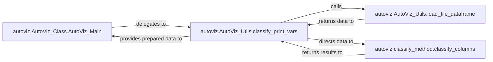

## Details

The AutoViz data preparation subsystem is orchestrated by AutoViz_Class.AutoViz_Main, which initiates the data processing pipeline. The central component, AutoViz_Utils.classify_print_vars, manages the flow by first invoking AutoViz_Utils.load_file_dataframe to ingest and standardize the input data. Once the data is loaded, classify_print_vars then passes a sampled version of this data to classify_method.classify_columns for detailed variable type identification and initial data quality assessment. The classification results and prepared data are subsequently returned to classify_print_vars, which then consolidates this information before providing the final prepared dataset and metadata back to AutoViz_Class.AutoViz_Main for further visualization stages. This structured interaction ensures robust data handling and intelligent variable classification.

### autoviz.AutoViz_Class.AutoViz_Main
Serves as the high-level orchestrator and entry point from the main AutoViz API into the data preparation phase. It initiates the data loading and classification process by delegating to the specialized utility components.

**Related Classes/Methods**:

- <a href="https://github.com/AutoViML/AutoViz/blob/master/autoviz/AutoViz_Utils.py#L1612-L1789" target="_blank" rel="noopener noreferrer">`autoviz.AutoViz_Utils.classify_print_vars`:1612-1789</a>

### autoviz.AutoViz_Utils.classify_print_vars
Acts as the central manager within the data preparation pipeline. It coordinates the data loading, triggers the column classification, and aggregates the resulting metadata about the dataset. This component is crucial for bridging the raw data input with the classification logic.

**Related Classes/Methods**:

- <a href="https://github.com/AutoViML/AutoViz/blob/master/autoviz/AutoViz_Utils.py#L1549-L1608" target="_blank" rel="noopener noreferrer">`autoviz.AutoViz_Utils.load_file_dataframe`:1549-1608</a>
- <a href="https://github.com/AutoViML/AutoViz/blob/master/autoviz/classify_method.py#L68-L336" target="_blank" rel="noopener noreferrer">`autoviz.classify_method.classify_columns`:68-336</a>

### autoviz.AutoViz_Utils.load_file_dataframe
Handles the fundamental task of reading data from various input sources (e.g., CSV, text, JSON, Excel) or directly from a Pandas DataFrame. It ensures data is in a standardized and usable format for subsequent analysis, including handling nrows for sampling and removing duplicate columns.

**Related Classes/Methods**:

- <a href="https://github.com/AutoViML/AutoViz/blob/master/autoviz/AutoViz_Utils.py#L1549-L1608" target="_blank" rel="noopener noreferrer">`autoviz.AutoViz_Utils.load_file_dataframe`:1549-1608</a>

### autoviz.classify_method.classify_columns
Implements the core intelligence for automatically identifying and categorizing the data type and semantic role of each column within the loaded DataFrame. This includes distinguishing between numerical, categorical, date, ID, boolean, and NLP (text) variables, and also identifies columns to be deleted based on criteria like single unique value, high missing values, mixed data types, or infinity values.

**Related Classes/Methods**:

- <a href="https://github.com/AutoViML/AutoViz/blob/master/autoviz/classify_method.py#L68-L336" target="_blank" rel="noopener noreferrer">`autoviz.classify_method.classify_columns`:68-336</a>

### [FAQ](https://github.com/CodeBoarding/GeneratedOnBoardings/tree/main?tab=readme-ov-file#faq)