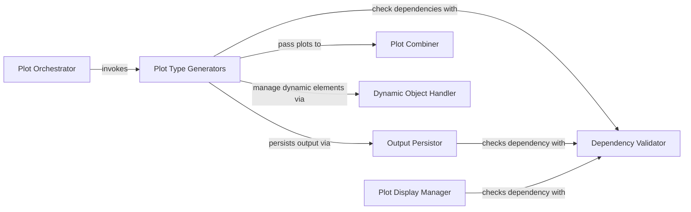

## Details

The HoloViews/hvPlot Plotting Engine subsystem is primarily defined by the autoviz.AutoViz_Holo class and its methods, which are responsible for generating, manipulating, and displaying interactive plots using the HoloViews and hvPlot libraries. Its boundaries encompass the core logic for visualization generation and output within the AutoViz project.

### Plot Orchestrator
Serves as the primary interface for initiating and coordinating the generation of various plot types. It embodies the Facade Pattern, simplifying complex visualization tasks for the user.

**Related Classes/Methods**:

- <a href="https://github.com/AutoViML/AutoViz/blob/master/autoviz/AutoViz_Holo.py" target="_blank" rel="noopener noreferrer">`autoviz.AutoViz_Holo`</a>

### Plot Type Generators
A collection of specialized components, each responsible for generating a specific type of plot (e.g., KDE, Scatter, Heatmap) using the HoloViews/hvPlot backend. This aligns with the Strategy Pattern and Modular Visualization, allowing for flexible plot generation.

**Related Classes/Methods**:

- <a href="https://github.com/AutoViML/AutoViz/blob/master/autoviz/AutoViz_Holo.py" target="_blank" rel="noopener noreferrer">`autoviz.AutoViz_Holo:draw_kdeplot_hv`</a>
- <a href="https://github.com/AutoViML/AutoViz/blob/master/autoviz/AutoViz_Holo.py" target="_blank" rel="noopener noreferrer">`autoviz.AutoViz_Holo:draw_scatters_hv`</a>
- <a href="https://github.com/AutoViML/AutoViz/blob/master/autoviz/AutoViz_Holo.py" target="_blank" rel="noopener noreferrer">`autoviz.AutoViz_Holo:draw_cat_vars_hv`</a>
- <a href="https://github.com/AutoViML/AutoViz/blob/master/autoviz/AutoViz_Holo.py" target="_blank" rel="noopener noreferrer">`autoviz.AutoViz_Holo:draw_distplot_hv`</a>
- <a href="https://github.com/AutoViML/AutoViz/blob/master/autoviz/AutoViz_Holo.py" target="_blank" rel="noopener noreferrer">`autoviz.AutoViz_Holo:draw_violinplot_hv`</a>
- <a href="https://github.com/AutoViML/AutoViz/blob/master/autoviz/AutoViz_Holo.py" target="_blank" rel="noopener noreferrer">`autoviz.AutoViz_Holo:draw_pair_scatters_hv`</a>
- <a href="https://github.com/AutoViML/AutoViz/blob/master/autoviz/AutoViz_Holo.py" target="_blank" rel="noopener noreferrer">`autoviz.AutoViz_Holo:draw_date_vars_hv`</a>
- <a href="https://github.com/AutoViML/AutoViz/blob/master/autoviz/AutoViz_Holo.py" target="_blank" rel="noopener noreferrer">`autoviz.AutoViz_Holo:draw_heatmap_hv`</a>

### Output Persistor
Handles the saving of generated plot data, typically as HTML, facilitating the export and sharing of visualizations. This aligns with the "Output & Export" expected component.

**Related Classes/Methods**:

- <a href="https://github.com/AutoViML/AutoViz/blob/master/autoviz/AutoViz_Holo.py" target="_blank" rel="noopener noreferrer">`autoviz.AutoViz_Holo:save_html_data`</a>

### Plot Combiner
Responsible for combining multiple individual plots into a unified panel or dashboard, enhancing the overall presentation and enabling complex layouts.

**Related Classes/Methods**:

- <a href="https://github.com/AutoViML/AutoViz/blob/master/autoviz/AutoViz_Holo.py" target="_blank" rel="noopener noreferrer">`autoviz.AutoViz_Holo:append_panels`</a>

### Dependency Validator
A utility component that ensures the necessary hvplot library is correctly imported and available before any plotting operations are attempted, preventing runtime errors.

**Related Classes/Methods**:

- <a href="https://github.com/AutoViML/AutoViz/blob/master/autoviz/AutoViz_Holo.py" target="_blank" rel="noopener noreferrer">`autoviz.AutoViz_Holo:ensure_hvplot_imported`</a>

### Dynamic Object Handler
Manages and returns dynamic plot elements, indicating support for interactive features or data exploration within the visualizations.

**Related Classes/Methods**:

- <a href="https://github.com/AutoViML/AutoViz/blob/master/autoviz/AutoViz_Holo.py" target="_blank" rel="noopener noreferrer">`autoviz.AutoViz_Holo:return_dynamic_objects`</a>

### Plot Display Manager
Handles the rendering and presentation of the generated plots, whether as dynamic maps, generic objects, or served via a local server. This is crucial for user interaction with the visualizations.

**Related Classes/Methods**:

- <a href="https://github.com/AutoViML/AutoViz/blob/master/autoviz/AutoViz_Holo.py" target="_blank" rel="noopener noreferrer">`autoviz.AutoViz_Holo:display_dmap`</a>
- <a href="https://github.com/AutoViML/AutoViz/blob/master/autoviz/AutoViz_Holo.py" target="_blank" rel="noopener noreferrer">`autoviz.AutoViz_Holo:display_obj`</a>
- <a href="https://github.com/AutoViML/AutoViz/blob/master/autoviz/AutoViz_Holo.py" target="_blank" rel="noopener noreferrer">`autoviz.AutoViz_Holo:display_server`</a>

### [FAQ](https://github.com/CodeBoarding/GeneratedOnBoardings/tree/main?tab=readme-ov-file#faq)