```mermaid
graph LR
    AutoViz_API_Orchestrator["AutoViz API & Orchestrator"]
    Data_Loader_Classifier["Data Loader & Classifier"]
    Data_Preprocessing_Feature_Engineering["Data Preprocessing & Feature Engineering"]
    NLP_Data_Processor["NLP Data Processor"]
    Matplotlib_Seaborn_Plotting_Engine["Matplotlib/Seaborn Plotting Engine"]
    HoloViews_hvPlot_Plotting_Engine["HoloViews/hvPlot Plotting Engine"]
    Visualization_Output_Export_Manager["Visualization Output & Export Manager"]
    AutoViz_API_Orchestrator -- "Initiates Data Loading & Classification" --> Data_Loader_Classifier
    AutoViz_API_Orchestrator -- "Orchestrates Data Preprocessing" --> Data_Preprocessing_Feature_Engineering
    AutoViz_API_Orchestrator -- "Triggers NLP Processing if text data" --> NLP_Data_Processor
    AutoViz_API_Orchestrator -- "Selects & Triggers Static Plotting" --> Matplotlib_Seaborn_Plotting_Engine
    AutoViz_API_Orchestrator -- "Selects & Triggers Interactive Plotting" --> HoloViews_hvPlot_Plotting_Engine
    Data_Loader_Classifier -- "Provides Classified Data" --> Data_Preprocessing_Feature_Engineering
    Data_Loader_Classifier -- "Sends Text Data for Processing" --> NLP_Data_Processor
    Data_Preprocessing_Feature_Engineering -- "Provides Processed Data" --> Matplotlib_Seaborn_Plotting_Engine
    Data_Preprocessing_Feature_Engineering -- "Provides Processed Data" --> HoloViews_hvPlot_Plotting_Engine
    NLP_Data_Processor -- "Sends Word Clouds/Text Visualizations" --> Visualization_Output_Export_Manager
    Matplotlib_Seaborn_Plotting_Engine -- "Sends Generated Static Plots" --> Visualization_Output_Export_Manager
    HoloViews_hvPlot_Plotting_Engine -- "Sends Generated Interactive Plots" --> Visualization_Output_Export_Manager
    click AutoViz_API_Orchestrator href "https://github.com/CodeBoarding/GeneratedOnBoardings/blob/main/AutoViz/AutoViz_API_Orchestrator.md" "Details"
    click Data_Loader_Classifier href "https://github.com/CodeBoarding/GeneratedOnBoardings/blob/main/AutoViz/Data_Loader_Classifier.md" "Details"
    click HoloViews_hvPlot_Plotting_Engine href "https://github.com/CodeBoarding/GeneratedOnBoardings/blob/main/AutoViz/HoloViews_hvPlot_Plotting_Engine.md" "Details"
```

## Details

The `AutoViz` architecture is designed as a streamlined data visualization pipeline, centered around the `AutoViz API & Orchestrator` which acts as a facade for automated exploratory data analysis. Data flows sequentially, beginning with the `Data Loader & Classifier` for ingestion and type inference, then moving to `Data Preprocessing & Feature Engineering` for refinement. Text-specific data is routed through the `NLP Data Processor`. Depending on the visualization requirements, processed data is fed into either the `Matplotlib/Seaborn Plotting Engine` for static outputs or the `HoloViews/hvPlot Plotting Engine` for interactive visualizations. All generated plots converge at the `Visualization Output & Export Manager` for final display and saving, providing a comprehensive and automated EDA workflow.

### AutoViz API & Orchestrator [[Expand]](./AutoViz_API_Orchestrator.md)
The primary user-facing interface and control center, orchestrating the entire EDA and visualization pipeline.

**Related Classes/Methods**:

- <a href="https://github.com/AutoViML/AutoViz/blob/master/autoviz/AutoViz_Class.py" target="_blank" rel="noopener noreferrer">`autoviz.AutoViz_Class`</a>

### Data Loader & Classifier [[Expand]](./Data_Loader_Classifier.md)
Handles initial data loading and automatic classification of column types.

**Related Classes/Methods**:

- <a href="https://github.com/AutoViML/AutoViz/blob/master/autoviz/AutoViz_Class.py" target="_blank" rel="noopener noreferrer">`autoviz.AutoViz_Class`</a>
- <a href="https://github.com/AutoViML/AutoViz/blob/master/autoviz/classify_method.py" target="_blank" rel="noopener noreferrer">`autoviz.classify_method`</a>

### Data Preprocessing & Feature Engineering
Manages advanced data preparation, including cleaning, transformation, and feature selection.

**Related Classes/Methods**:

- <a href="https://github.com/AutoViML/AutoViz/blob/master/autoviz/AutoViz_Utils.py" target="_blank" rel="noopener noreferrer">`autoviz.AutoViz_Utils`</a>

### NLP Data Processor
Specialized module for text data cleaning and text-specific visualization generation.

**Related Classes/Methods**:

- <a href="https://github.com/AutoViML/AutoViz/blob/master/autoviz/AutoViz_NLP.py" target="_blank" rel="noopener noreferrer">`autoviz.AutoViz_NLP`</a>

### Matplotlib/Seaborn Plotting Engine
Generates static statistical and relational plots.

**Related Classes/Methods**:

- <a href="https://github.com/AutoViML/AutoViz/blob/master/autoviz/AutoViz_Utils.py" target="_blank" rel="noopener noreferrer">`autoviz.AutoViz_Utils`</a>

### HoloViews/hvPlot Plotting Engine [[Expand]](./HoloViews_hvPlot_Plotting_Engine.md)
Provides an interactive visualization backend for dynamic plots.

**Related Classes/Methods**:

- <a href="https://github.com/AutoViML/AutoViz/blob/master/autoviz/AutoViz_Holo.py" target="_blank" rel="noopener noreferrer">`autoviz.AutoViz_Holo`</a>

### Visualization Output & Export Manager
Manages saving and displaying all generated visualizations.

**Related Classes/Methods**:

- <a href="https://github.com/AutoViML/AutoViz/blob/master/autoviz/AutoViz_Utils.py" target="_blank" rel="noopener noreferrer">`autoviz.AutoViz_Utils`</a>
- <a href="https://github.com/AutoViML/AutoViz/blob/master/autoviz/AutoViz_Holo.py" target="_blank" rel="noopener noreferrer">`autoviz.AutoViz_Holo`</a>

### [FAQ](https://github.com/CodeBoarding/GeneratedOnBoardings/tree/main?tab=readme-ov-file#faq)