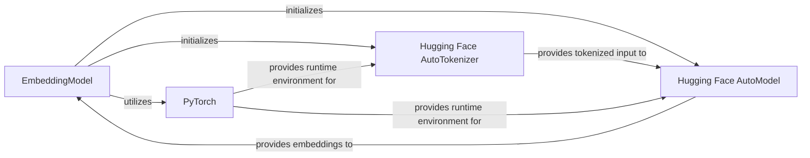

## Details

The `BCEmbedding` subsystem's core functionality revolves around the `EmbeddingModel`. This component acts as the primary orchestrator, responsible for initializing and managing the lifecycle of external machine learning components. It leverages the `Hugging Face AutoTokenizer` to preprocess raw text into a tokenized format suitable for deep learning models. The tokenized input is then fed into the `Hugging Face AutoModel`, which performs the actual embedding computation. Both the `AutoTokenizer` and `AutoModel` operate within the computational environment provided by `PyTorch`, which handles tensor operations, device placement (CPU/GPU), and model execution. The `EmbeddingModel` then processes the outputs from the `AutoModel` to produce the final, normalized text embeddings, providing a streamlined interface for users.

### EmbeddingModel
The central component and public interface of the embedding subsystem. It orchestrates the loading of pre-trained models and tokenizers, manages device placement (CPU/GPU), and executes the forward pass to generate text embeddings. It abstracts away the complexities of the underlying ML frameworks, providing a unified API for users.

**Related Classes/Methods**:

- <a href="https://github.com/netease-youdao/BCEmbedding/blob/master/BCEmbedding/models/embedding.py#L20-L120" target="_blank" rel="noopener noreferrer">`BCEmbedding.models.embedding.EmbeddingModel`:20-120</a>

### Hugging Face AutoModel
An external library component representing the loaded pre-trained transformer model (e.g., BERT, RoBERTa) from the Hugging Face `transformers` library. This component is responsible for taking tokenized input from `Hugging Face AutoTokenizer` and computing contextualized embeddings, which are then pooled by `EmbeddingModel` to form the final dense vector representation.

**Related Classes/Methods**: _None_

### Hugging Face AutoTokenizer
An external library component from the Hugging Face `transformers` library. It handles the crucial preprocessing step of converting raw text strings into numerical tokens, attention masks, and token type IDs, as required by the `Hugging Face AutoModel`. `EmbeddingModel` utilizes this component to prepare text input for the transformer model.

**Related Classes/Methods**: _None_

### PyTorch
An external foundational deep learning framework that provides the core tensor computation capabilities, GPU acceleration, and the execution environment for both the `Hugging Face AutoModel` and `AutoTokenizer`. All numerical operations, model loading, and inference within the embedding process, orchestrated by `EmbeddingModel`, rely on PyTorch.

**Related Classes/Methods**: _None_

### [FAQ](https://github.com/CodeBoarding/GeneratedOnBoardings/tree/main?tab=readme-ov-file#faq)