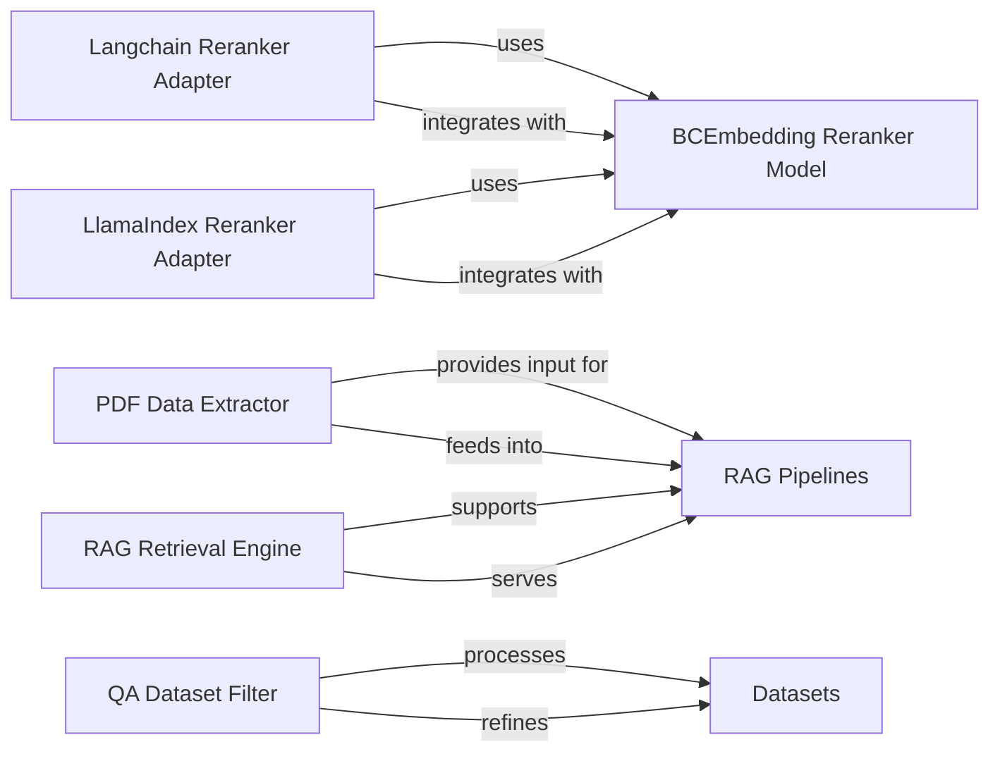

## Details

The BCEmbedding project's subsystem focuses on enhancing Retrieval Augmented Generation (RAG) capabilities through specialized reranking and robust data processing. At its core, the BCEmbedding Reranker Model provides advanced document reranking, integrated into various frameworks via Langchain Reranker Adapter and LlamaIndex Reranker Adapter. Data preparation for RAG pipelines begins with the PDF Data Extractor, which processes raw documents, and the QA Dataset Filter, which curates Datasets for quality. The RAG Pipelines component orchestrates the overall RAG process, relying on the RAG Retrieval Engine for efficient document fetching. This architecture ensures high-quality data input, optimized retrieval, and flexible integration with popular AI frameworks.

### Langchain Reranker Adapter
Integrates the BCEmbedding Reranker Model into Langchain's document processing pipeline, enhancing document relevance through reranking.

**Related Classes/Methods**:

- <a href="https://github.com/netease-youdao/BCEmbedding/blob/master/BCEmbedding/tools/langchain/bce_rerank.py" target="_blank" rel="noopener noreferrer">`BCEmbedding.tools.langchain.bce_rerank`</a>

### LlamaIndex Reranker Adapter
Adapts the BCEmbedding Reranker Model for use within LlamaIndex's node post-processing, refining retrieved nodes for improved relevance.

**Related Classes/Methods**:

- <a href="https://github.com/netease-youdao/BCEmbedding/blob/master/BCEmbedding/tools/llama_index/bce_rerank.py" target="_blank" rel="noopener noreferrer">`BCEmbedding.tools.llama_index.bce_rerank`</a>

### BCEmbedding Reranker Model
The core model providing document reranking capabilities, utilized by various framework-specific adapters.

**Related Classes/Methods**: _None_

### PDF Data Extractor
Extracts raw text content from PDF documents, preparing unstructured data for subsequent processing in RAG pipelines.

**Related Classes/Methods**:

- <a href="https://github.com/netease-youdao/BCEmbedding/blob/master/BCEmbedding/tools/eval_rag/utils.py#L112-L125" target="_blank" rel="noopener noreferrer">`extract_data_from_pdf`:112-125</a>

### QA Dataset Filter
Curates and filters datasets to meet quality requirements for Question-Answering (QA) tasks, ensuring data suitability.

**Related Classes/Methods**:

- <a href="https://github.com/netease-youdao/BCEmbedding/blob/master/BCEmbedding/tools/eval_rag/utils.py#L70-L92" target="_blank" rel="noopener noreferrer">`filter_qa_dataset`:70-92</a>

### Datasets
Represents collections of raw or processed data, primarily QA datasets, used for evaluation and training within the RAG framework.

**Related Classes/Methods**: _None_

### RAG Pipelines
The high-level system orchestrating retrieval and generation processes, consuming processed data and leveraging the retrieval engine for RAG tasks.

**Related Classes/Methods**: _None_

### RAG Retrieval Engine
Provides comprehensive document retrieval capabilities, offering both synchronous and asynchronous interfaces to fetch relevant documents for RAG tasks.

**Related Classes/Methods**:

- <a href="https://github.com/netease-youdao/BCEmbedding/blob/master/BCEmbedding/tools/eval_rag/utils.py#L153-L159" target="_blank" rel="noopener noreferrer">`aretrieve`:153-159</a>
- <a href="https://github.com/netease-youdao/BCEmbedding/blob/master/BCEmbedding/tools/eval_rag/utils.py#L153-L159" target="_blank" rel="noopener noreferrer">`_aretrieve`:153-159</a>
- <a href="https://github.com/netease-youdao/BCEmbedding/blob/master/BCEmbedding/tools/eval_rag/utils.py#L141-L151" target="_blank" rel="noopener noreferrer">`_retrieve`:141-151</a>

### [FAQ](https://github.com/CodeBoarding/GeneratedOnBoardings/tree/main?tab=readme-ov-file#faq)