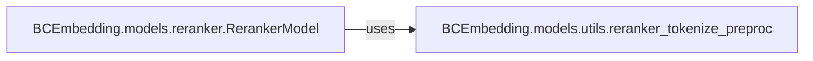

## Details

The `Reranker Models` subsystem is primarily defined by the `BCEmbedding/models/reranker.py` module, which encapsulates the core logic for loading, managing, and executing reranker models. It is supported by utility functions within `BCEmbedding/models/utils.py` that handle data preprocessing specific to reranking tasks. This subsystem's responsibility is to re-order retrieved documents based on their relevance to a given query, leveraging various model architectures (e.g., bi-encoder, cross-encoder).

### BCEmbedding.models.reranker.RerankerModel
This is the central orchestrator of the reranking process. It is responsible for initializing and loading pre-trained reranker models and their associated tokenizers from Hugging Face. It manages hardware considerations such as device placement (CPU/GPU) and precision settings (FP16). Its core functionality includes the `compute_score` method, which calculates relevance scores for sentence pairs, and the `rerank` method, which takes a query and a list of passages, preprocesses them, performs batch inference, and reorders the passages based on the computed scores. It optimizes inference by processing inputs in batches and can leverage multiple GPUs.

**Related Classes/Methods**:

- <a href="https://github.com/netease-youdao/BCEmbedding/blob/master/BCEmbedding/models/reranker.py#L24-L156" target="_blank" rel="noopener noreferrer">`BCEmbedding.models.reranker.RerankerModel`:24-156</a>

### BCEmbedding.models.utils.reranker_tokenize_preproc
This utility component is responsible for preparing and tokenizing query-passage pairs into a format suitable for the reranker model. It ensures that inputs adhere to the model's expected structure and handles specific preprocessing steps, including potential splitting of long passages to accommodate model input limitations.

**Related Classes/Methods**:

- <a href="https://github.com/netease-youdao/BCEmbedding/blob/master/BCEmbedding/models/utils.py#L11-L63" target="_blank" rel="noopener noreferrer">`BCEmbedding.models.utils.reranker_tokenize_preproc`:11-63</a>

### [FAQ](https://github.com/CodeBoarding/GeneratedOnBoardings/tree/main?tab=readme-ov-file#faq)