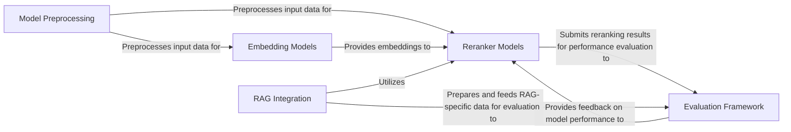

## Details

The BCEmbedding project is designed as a modular ML toolkit primarily focused on providing high-performance embedding and reranking capabilities for Retrieval Augmented Generation (RAG) and semantic search, especially in bilingual and crosslingual contexts.

### Embedding Models [[Expand]](./Embedding_Models.md)
Core component for generating dense vector representations of text, foundational for retrieval tasks.

**Related Classes/Methods**:

- <a href="https://github.com/netease-youdao/BCEmbedding/blob/master/BCEmbedding/models/embedding.py" target="_blank" rel="noopener noreferrer">`embedding.py`</a>

### Reranker Models [[Expand]](./Reranker_Models.md)
Implements various models (bi-encoder, cross-encoder) to re-order retrieved documents based on relevance to a query.

**Related Classes/Methods**:

- <a href="https://github.com/netease-youdao/BCEmbedding/blob/master/BCEmbedding/models/reranker.py" target="_blank" rel="noopener noreferrer">`reranker.py`</a>

### Model Preprocessing
Handles the preparation of raw input data, including tokenization and input merging, for consumption by both embedding and reranker models.

**Related Classes/Methods**:

- <a href="https://github.com/netease-youdao/BCEmbedding/blob/master/BCEmbedding/models/utils.py" target="_blank" rel="noopener noreferrer">`utils.py`</a>

### Evaluation Framework
Orchestrates the evaluation of models, particularly rerankers, by loading datasets, computing performance metrics, and integrating with specialized evaluators.

**Related Classes/Methods**:

- <a href="https://github.com/netease-youdao/BCEmbedding/blob/master/BCEmbedding/evaluation/c_mteb/Reranking.py" target="_blank" rel="noopener noreferrer">`Reranking.py`</a>
- <a href="https://github.com/netease-youdao/BCEmbedding/blob/master/BCEmbedding/evaluation/c_mteb/Retrieval.py" target="_blank" rel="noopener noreferrer">`Retrieval.py`</a>

### RAG Integration [[Expand]](./RAG_Integration.md)
Provides interfaces and utilities for seamlessly integrating BCEmbedding's models into RAG pipelines built with frameworks like Langchain and LlamaIndex, including data extraction and retrieval logic.

**Related Classes/Methods**:

- <a href="https://github.com/netease-youdao/BCEmbedding/blob/master/BCEmbedding/tools/langchain/bce_rerank.py" target="_blank" rel="noopener noreferrer">`bce_rerank.py`</a>
- <a href="https://github.com/netease-youdao/BCEmbedding/blob/master/BCEmbedding/tools/llama_index/bce_rerank.py" target="_blank" rel="noopener noreferrer">`bce_rerank.py`</a>
- <a href="https://github.com/netease-youdao/BCEmbedding/blob/master/BCEmbedding/tools/eval_rag/utils.py" target="_blank" rel="noopener noreferrer">`utils.py`</a>

### [FAQ](https://github.com/CodeBoarding/GeneratedOnBoardings/tree/main?tab=readme-ov-file#faq)