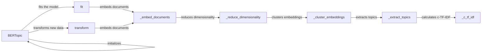

## Component Details

The BERTopic core orchestrates the topic modeling process, managing the model's lifecycle from initialization to topic extraction and updates. It provides a user-friendly interface for fitting the model, transforming documents, and accessing topic information. The core functionality revolves around embedding documents, reducing dimensionality, clustering, and extracting meaningful topics.

### BERTopic
The main class that encapsulates the entire topic modeling process. It initializes the model with various parameters, manages the internal state, and exposes methods for fitting, transforming, and analyzing topics.
- **Related Classes/Methods**: `BERTopic.bertopic._bertopic.BERTopic`

### fit
This method is responsible for fitting the BERTopic model to a set of documents. It orchestrates the embedding of documents, dimensionality reduction, clustering, and topic extraction steps.
- **Related Classes/Methods**: `BERTopic.bertopic._bertopic.BERTopic:fit`

### transform
Transforms new documents using a pre-trained BERTopic model. It embeds the documents and predicts the corresponding topics and probabilities based on the existing model.
- **Related Classes/Methods**: `BERTopic.bertopic._bertopic.BERTopic:transform`

### _embed_documents
Embeds the input documents using a specified embedding model. This creates numerical representations of the text, capturing semantic information for downstream tasks.
- **Related Classes/Methods**: `BERTopic.bertopic._bertopic.BERTopic:_embed_documents`

### _reduce_dimensionality
Reduces the dimensionality of the document embeddings using techniques like UMAP. This simplifies the data and improves the efficiency of clustering.
- **Related Classes/Methods**: `BERTopic.bertopic._bertopic.BERTopic:_reduce_dimensionality`

### _cluster_embeddings
Clusters the document embeddings to group similar documents together. Each cluster represents a potential topic.
- **Related Classes/Methods**: `BERTopic.bertopic._bertopic.BERTopic:_cluster_embeddings`

### _extract_topics
Extracts the most representative words for each topic by analyzing the clustered documents. This involves calculating the Class-based TF-IDF scores to identify important terms.
- **Related Classes/Methods**: `BERTopic.bertopic._bertopic.BERTopic:_extract_topics`

### _c_tf_idf
Calculates the Class-based TF-IDF matrix, which is used to identify the most important words within each topic cluster. This helps in defining the topic's meaning.
- **Related Classes/Methods**: `BERTopic.bertopic._bertopic.BERTopic:_c_tf_idf`
