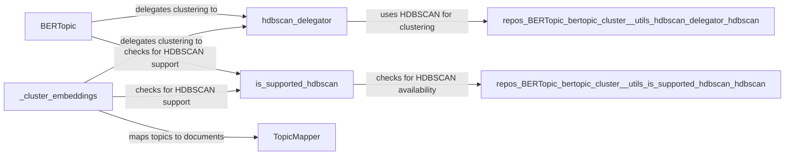

## Component Details

### BERTopic
The main class of the BERTopic model. It orchestrates the entire topic modeling process, including embedding documents, clustering embeddings, and representing topics. It uses various sub-components like vectorizers, dimensionality reduction techniques, and clustering algorithms to create a topic model from a set of documents.
- **Related Classes/Methods**: `repos.BERTopic.bertopic._bertopic.BERTopic`

### _cluster_embeddings
This method within the BERTopic class is responsible for clustering the document embeddings. It utilizes the hdbscan_delegator to perform the actual clustering and assigns documents to their respective topics. It also handles the mapping of topics to documents using TopicMapper.
- **Related Classes/Methods**: `repos.BERTopic.bertopic._bertopic.BERTopic:_cluster_embeddings`

### hdbscan_delegator
A utility function that selects and delegates the clustering task to the HDBSCAN algorithm. It chooses the appropriate HDBSCAN implementation based on the input data type and availability. This ensures that the most efficient HDBSCAN implementation is used for clustering.
- **Related Classes/Methods**: `bertopic.cluster._utils.hdbscan_delegator`, `repos.BERTopic.bertopic.cluster._utils.hdbscan_delegator.hdbscan`

### is_supported_hdbscan
A utility function that checks whether the HDBSCAN library is installed and supported in the current environment. This check is performed before attempting to use HDBSCAN for clustering, preventing errors if the library is not available.
- **Related Classes/Methods**: `bertopic.cluster._utils.is_supported_hdbscan`, `repos.BERTopic.bertopic.cluster._utils.is_supported_hdbscan.hdbscan`

### TopicMapper
A class that helps map topics to their corresponding documents. It is used to keep track of the relationships between topics and documents, especially after operations like merging topics. This ensures that the topic assignments remain consistent throughout the topic modeling process.
- **Related Classes/Methods**: `repos.BERTopic.bertopic._bertopic.TopicMapper`
