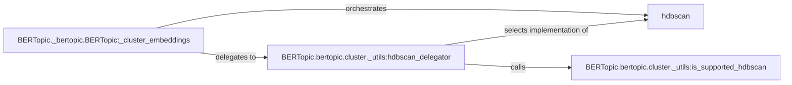

## Component Details

The Cluster Manager component is responsible for grouping reduced-dimensional document embeddings into clusters, where each cluster represents a topic. It leverages the HDBSCAN algorithm to identify clusters of documents with high similarity, effectively determining the topic to which each document belongs. The process involves selecting the appropriate HDBSCAN implementation, applying it to the embeddings, and updating the BERTopic model with the resulting cluster assignments.

### BERTopic._bertopic.BERTopic:_cluster_embeddings
This method is the central orchestrator for clustering document embeddings. It delegates the HDBSCAN implementation selection to `hdbscan_delegator`, applies the chosen algorithm, and integrates the resulting cluster assignments back into the BERTopic model. It manages the core logic of the clustering process.
- **Related Classes/Methods**: `BERTopic._bertopic.BERTopic:_cluster_embeddings`

### BERTopic.bertopic.cluster._utils:hdbscan_delegator
This function acts as a delegator, dynamically selecting the most suitable HDBSCAN implementation based on system capabilities, such as GPU availability. It abstracts the complexity of choosing the optimal HDBSCAN variant, providing a consistent interface for `_cluster_embeddings`.
- **Related Classes/Methods**: `BERTopic.bertopic.cluster._utils:hdbscan_delegator`

### BERTopic.bertopic.cluster._utils:is_supported_hdbscan
This function verifies the correct installation and support for the HDBSCAN library and its dependencies on the system. It ensures that the clustering process can proceed without errors caused by missing dependencies or incompatible environments.
- **Related Classes/Methods**: `BERTopic.bertopic.cluster._utils:is_supported_hdbscan`

### hdbscan
The HDBSCAN library is the core clustering algorithm used to group document embeddings based on similarity. It identifies clusters, with each cluster representing a distinct topic.
- **Related Classes/Methods**: `hdbscan`
