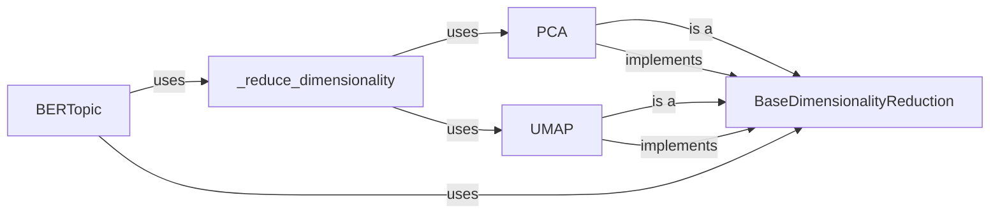

## Component Details

### BERTopic
The main class for the BERTopic model. It orchestrates the topic modeling process, including dimensionality reduction and document embedding. It provides the main interface for users to interact with the model, such as fitting the model, transforming documents, and extracting topic information.
- **Related Classes/Methods**: `bertopic._bertopic.BERTopic`

### _reduce_dimensionality
Reduces the dimensionality of document embeddings using a specified technique. This function is a core part of the BERTopic pipeline, as it prepares the embeddings for clustering by reducing noise and improving efficiency. It uses PCA or UMAP for dimensionality reduction.
- **Related Classes/Methods**: `bertopic._bertopic.BERTopic:_reduce_dimensionality`

### BaseDimensionalityReduction
An abstract base class for dimensionality reduction techniques. It defines the interface that all dimensionality reduction classes must implement, ensuring that they can be used interchangeably within the BERTopic model. This promotes flexibility and extensibility in the choice of dimensionality reduction methods.
- **Related Classes/Methods**: `bertopic.dimensionality._base.BaseDimensionalityReduction`

### PCA
Implements dimensionality reduction using Principal Component Analysis (PCA). It inherits from `BaseDimensionalityReduction` and provides a concrete implementation of the `reduce_dimensionality` method using PCA. PCA is used to project the high-dimensional embeddings into a lower-dimensional space while preserving the most important variance in the data.
- **Related Classes/Methods**: `bertopic.dimensionality.pca.PCA`

### UMAP
Implements dimensionality reduction using Uniform Manifold Approximation and Projection (UMAP). It inherits from `BaseDimensionalityReduction` and provides a concrete implementation of the `reduce_dimensionality` method using UMAP. UMAP is used to project the high-dimensional embeddings into a lower-dimensional space while preserving the local and global structure of the data.
- **Related Classes/Methods**: `bertopic.dimensionality.umap.UMAP`
