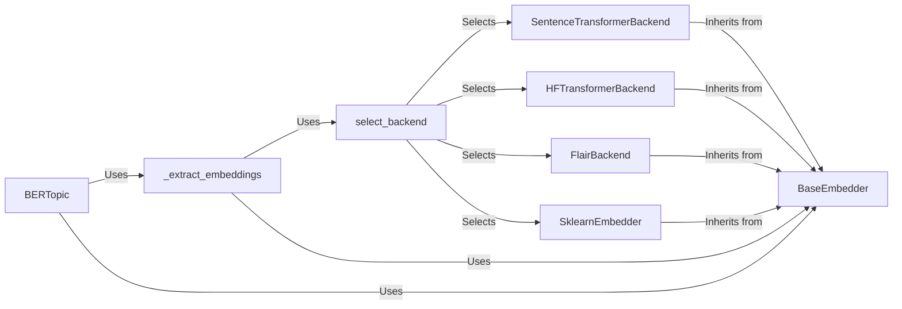

## Component Details

### BERTopic
The main class for the BERTopic model. It orchestrates the topic modeling process, including embedding extraction, topic creation, and topic management. It uses the `_extract_embeddings` method to generate document embeddings.
- **Related Classes/Methods**: `bertopic/_bertopic.py`

### BaseEmbedder
Abstract base class for all embedding backends. Defines the interface for embedding words and documents, ensuring that all backends implement a common `embed` method.
- **Related Classes/Methods**: `bertopic/backend/_base.py`

### select_backend
A utility function that selects the appropriate embedding backend based on the provided embedding model or string identifier. It supports various backends like Sentence Transformers, Flair, Spacy, and Hugging Face Transformers.
- **Related Classes/Methods**: `bertopic/backend/_utils.py`

### SentenceTransformerBackend
An embedding backend that uses Sentence Transformers to generate embeddings. It inherits from `BaseEmbedder` and implements the `embed` method using Sentence Transformers.
- **Related Classes/Methods**: `bertopic/backend/_sentencetransformers.py`

### HFTransformerBackend
An embedding backend that uses Hugging Face Transformers to generate embeddings. It inherits from `BaseEmbedder` and implements the `embed` method using Hugging Face Transformers.
- **Related Classes/Methods**: `bertopic/backend/_hftransformers.py`

### FlairBackend
An embedding backend that uses Flair to generate embeddings. It inherits from `BaseEmbedder` and implements the `embed` method using Flair.
- **Related Classes/Methods**: `bertopic/backend/_flair.py`

### SklearnEmbedder
An embedding backend that uses scikit-learn models to generate embeddings. It inherits from `BaseEmbedder` and implements the `embed` method using scikit-learn models.
- **Related Classes/Methods**: `bertopic/backend/_sklearn.py`

### _extract_embeddings
Extracts embeddings from documents using the selected backend. This method is part of the BERTopic class and uses the `select_backend` function to choose the appropriate embedding model.
- **Related Classes/Methods**: `bertopic/_bertopic.py`
