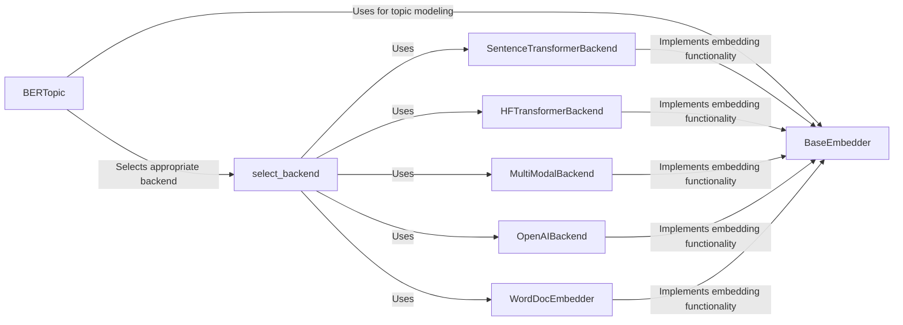

## Component Details

The Embedding Handler component in BERTopic is responsible for transforming documents into numerical vector representations, enabling semantic analysis and topic modeling. It provides a unified interface for various embedding techniques, including transformer models, word embeddings, and cloud-based services like OpenAI. The process begins with the BERTopic class selecting an appropriate embedding backend based on the user's configuration. This backend then converts the input documents into embeddings, which are subsequently used for dimensionality reduction and clustering to identify topics.

### BERTopic
The main class that orchestrates the topic modeling process. It initializes and manages the embedding backend, using it to transform documents into embeddings.
- **Related Classes/Methods**: `BERTopic.bertopic._bertopic.BERTopic`

### BaseEmbedder
Abstract base class for embedding models. Defines the interface for embedding words and documents, ensuring that all concrete embedding backends implement a consistent `embed` method.
- **Related Classes/Methods**: `BERTopic.bertopic.backend._base.BaseEmbedder`

### SentenceTransformerBackend
A backend that uses Sentence Transformers to embed documents. It leverages pre-trained transformer models to generate high-quality embeddings.
- **Related Classes/Methods**: `BERTopic.bertopic.backend._sentencetransformers.SentenceTransformerBackend`

### HFTransformerBackend
A backend that uses Hugging Face Transformers to embed documents. It provides flexibility in choosing from a wide range of transformer models available on the Hugging Face Model Hub.
- **Related Classes/Methods**: `BERTopic.bertopic.backend._hftransformers.HFTransformerBackend`

### MultiModalBackend
A backend that handles multimodal embeddings, potentially truncating documents to fit within model constraints. It is designed to work with models that accept multiple types of input.
- **Related Classes/Methods**: `BERTopic.bertopic.backend._multimodal.MultiModalBackend`

### select_backend
A utility function to select the appropriate embedding backend based on the provided model or configuration. It simplifies the process of choosing the right embedding method for a given task.
- **Related Classes/Methods**: `BERTopic.bertopic.backend._utils`

### OpenAIBackend
A backend that uses OpenAI models to embed documents. It allows leveraging OpenAI's powerful language models for generating embeddings.
- **Related Classes/Methods**: `BERTopic.bertopic.backend._openai.OpenAIBackend`

### WordDocEmbedder
A backend that uses word embeddings to embed documents. It aggregates word embeddings to create document embeddings.
- **Related Classes/Methods**: `BERTopic.bertopic.backend._word_doc.WordDocEmbedder`
