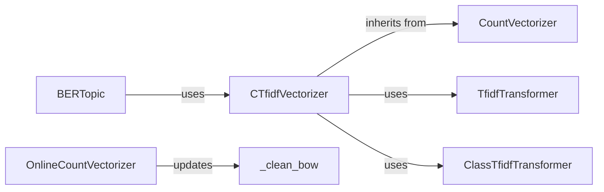

## Component Details

### BERTopic
The main class for the BERTopic model. It orchestrates the topic modeling process, including vectorization, topic reduction, and document embedding. It uses the CTfidfVectorizer to convert text into a numerical representation.
- **Related Classes/Methods**: `bertopic._bertopic.BERTopic`

### CTfidfVectorizer
A custom vectorizer optimized for topic extraction. It combines CountVectorizer and TfidfTransformer to create a c-TF-IDF matrix, which represents the importance of words within topics. It inherits from CountVectorizer and uses TfidfTransformer.
- **Related Classes/Methods**: `bertopic.vectorizers._ctfidf.CTfidfVectorizer`

### ClassTfidfTransformer
Transforms a matrix of documents into a c-TF-IDF matrix. It is used to find the importance of words in a class/topic. It takes a sparse matrix as input and calculates the c-TF-IDF values.
- **Related Classes/Methods**: `bertopic.vectorizers._ctfidf.ClassTfidfTransformer`

### OnlineCountVectorizer
Incrementally updates a bag-of-words representation of documents. Useful for online topic modeling. It provides methods to update the vocabulary and counts with new documents.
- **Related Classes/Methods**: `bertopic.vectorizers._online_cv.OnlineCountVectorizer`

### _clean_bow
Cleans the bag of words representation by removing unwanted tokens. It is a helper function within OnlineCountVectorizer.
- **Related Classes/Methods**: `bertopic.vectorizers._online_cv.OnlineCountVectorizer._clean_bow`
