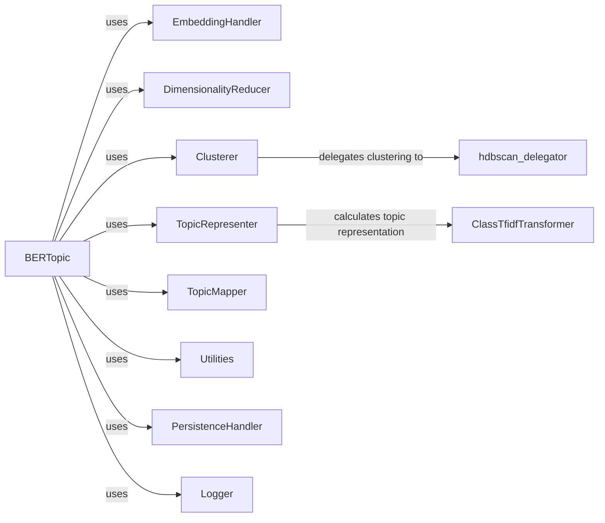

## Component Details

### BERTopic
The main class for topic modeling with BERTopic. It orchestrates the entire topic modeling process, including fitting the model, transforming documents, extracting topics, and providing utility functions. It initializes and manages other components like embedding extraction, dimensionality reduction, clustering, and topic representation.
- **Related Classes/Methods**: `bertopic/_bertopic.py`

### EmbeddingHandler
Handles the selection and application of embedding models. It selects the appropriate backend for embedding extraction based on the provided model or configuration and extracts embeddings from documents using a specified embedding model.
- **Related Classes/Methods**: `bertopic/backend/_utils.py`, `bertopic/_bertopic.py`

### DimensionalityReducer
Reduces the dimensionality of the embeddings to improve clustering performance and reduce noise. This component uses algorithms like UMAP to reduce the number of dimensions in the embedding space.
- **Related Classes/Methods**: `bertopic/_bertopic.py`

### Clusterer
Clusters the extracted embeddings to group similar documents together, forming initial topics. It delegates the clustering task to algorithms like HDBSCAN.
- **Related Classes/Methods**: `bertopic/_bertopic.py`, `bertopic/cluster/_utils.py`

### TopicRepresenter
Extracts the most representative words for each topic based on the clustered documents. It calculates the class-based TF-IDF (c-TF-IDF) matrix, which is used to identify the most important words in each topic.
- **Related Classes/Methods**: `bertopic/_bertopic.py`, `bertopic/vectorizers/_ctfidf.py`

### TopicMapper
A class that maps topics to each other. Used in partial fitting and merging of topics.
- **Related Classes/Methods**: `bertopic/_bertopic.py`

### Utilities
Includes utility functions for checking document types, updating topic sizes, and mapping probabilities.
- **Related Classes/Methods**: `bertopic/_utils.py`, `bertopic/_bertopic.py`

### PersistenceHandler
Handles saving and loading BERTopic models and their components.
- **Related Classes/Methods**: `bertopic/_save_utils.py`

### Logger
A custom logger used for logging information, warnings, and errors during the topic modeling process.
- **Related Classes/Methods**: `bertopic/_utils.py`
