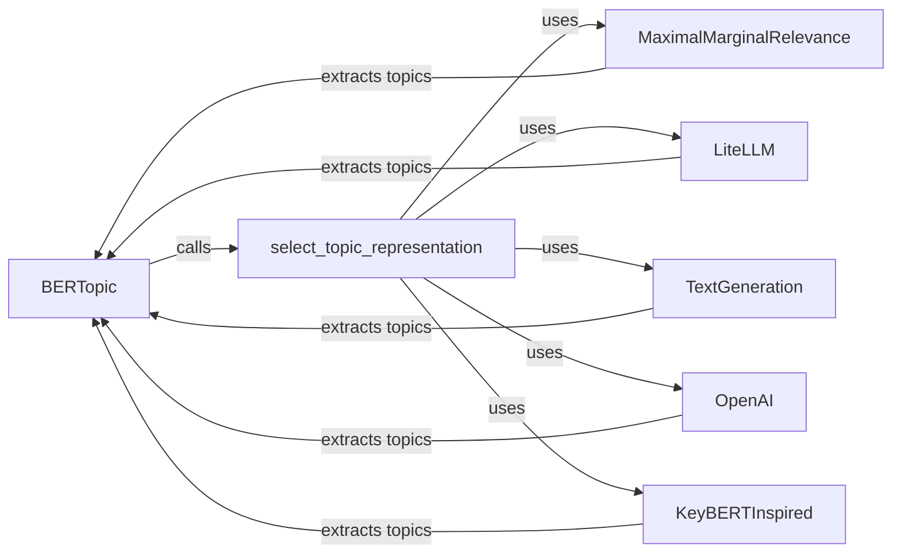

## Component Details

The Topic Representation Extractor component is responsible for generating human-interpretable descriptions of topics by extracting representative words and phrases. It leverages c-TF-IDF as a base and supports customization through various techniques, including KeyBERT and OpenAI, to refine topic representations. The main flow involves selecting a representation model based on configuration, extracting topic representations using the chosen model, and returning the refined topic descriptions.

### BERTopic
The main class that orchestrates the topic modeling process. It calls the representation models to refine topic representations by calling `_extract_topics`, `_c_tf_idf`, and `_extract_words_per_topic`.
- **Related Classes/Methods**: `BERTopic.bertopic._bertopic.BERTopic`

### select_topic_representation
A utility function that selects the appropriate topic representation model based on the configuration. It acts as a factory, returning an instance of the chosen representation model.
- **Related Classes/Methods**: `BERTopic.bertopic._utils:select_topic_representation`

### MaximalMarginalRelevance
A topic representation model that uses Maximal Marginal Relevance (MMR) to extract diverse and relevant keywords for each topic. It aims to reduce redundancy in the topic representation.
- **Related Classes/Methods**: `BERTopic.bertopic.representation._mmr.MaximalMarginalRelevance`

### LiteLLM
A topic representation model that uses LiteLLM to generate topic representations. It interacts with language models through LiteLLM's API.
- **Related Classes/Methods**: `BERTopic.bertopic.representation._litellm.LiteLLM`

### TextGeneration
A topic representation model that uses text generation to create topic representations. It generates text that describes the topic.
- **Related Classes/Methods**: `BERTopic.bertopic.representation._textgeneration.TextGeneration`

### OpenAI
A topic representation model that uses OpenAI's language models to generate topic representations. It interacts with OpenAI's API to generate topic descriptions.
- **Related Classes/Methods**: `BERTopic.bertopic.representation._openai.OpenAI`

### KeyBERTInspired
A topic representation model inspired by KeyBERT that extracts keywords based on their similarity to the topic. It uses embeddings to find keywords that are semantically close to the topic.
- **Related Classes/Methods**: `BERTopic.bertopic.representation._keybert.KeyBERTInspired`
