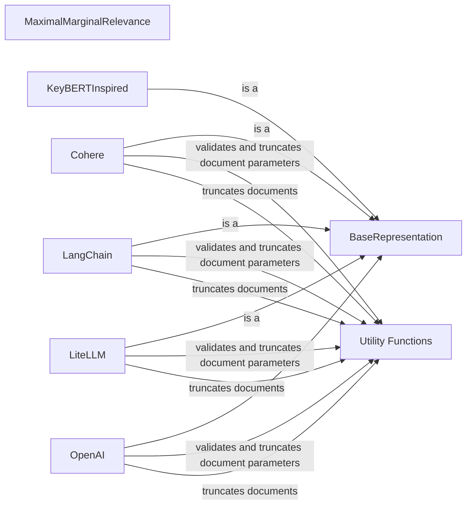

## Component Details

### BaseRepresentation
Abstract base class for topic representation models. It defines the interface for all representation models, ensuring they implement the `extract_topics` method. This class serves as a template for creating custom representation models, providing a consistent way to generate topic descriptions.
- **Related Classes/Methods**: `bertopic/representation/_base.py`

### MaximalMarginalRelevance
Implements Maximal Marginal Relevance (MMR) for diversifying topic representations. It selects documents or keywords that are both relevant to the topic and diverse from each other. This helps in generating more comprehensive and representative descriptions by avoiding redundancy.
- **Related Classes/Methods**: `bertopic/representation/_mmr.py`

### OpenAI
A topic representation model that uses the OpenAI API to generate topic descriptions. It takes an OpenAI model and generates descriptions based on the documents associated with each topic. It leverages the power of large language models to create human-interpretable topic labels.
- **Related Classes/Methods**: `bertopic/representation/_openai.py`

### LangChain
A topic representation model that leverages LangChain to generate topic descriptions. It uses a LangChain chain to generate descriptions based on the documents associated with each topic. This allows for flexible and customizable topic representation using various LangChain components.
- **Related Classes/Methods**: `bertopic/representation/_langchain.py`

### KeyBERTInspired
A topic representation model inspired by KeyBERT. It extracts keywords from the topic's documents and uses them as the topic representation. This provides a simple and effective way to identify the most important terms associated with each topic.
- **Related Classes/Methods**: `bertopic/representation/_keybert.py`

### Utility Functions
Includes utility functions for validating and truncating document parameters, truncating documents, and retrying functions with exponential backoff. These functions ensure the smooth and reliable operation of the representation models.
- **Related Classes/Methods**: `bertopic/representation/_utils.py`

### Cohere
A topic representation model that uses the Cohere language model to generate topic descriptions. It takes a Cohere model and generates descriptions based on the documents associated with each topic.
- **Related Classes/Methods**: `bertopic/representation/_cohere.py`

### LiteLLM
A topic representation model that uses LiteLLM to generate topic descriptions. It takes a LiteLLM model and generates descriptions based on the documents associated with each topic.
- **Related Classes/Methods**: `bertopic/representation/_litellm.py`
