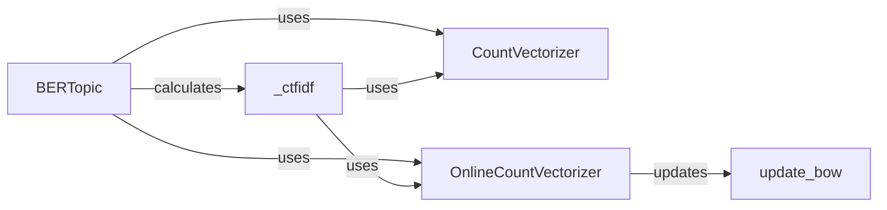

## Component Details

The Vectorizer Handler is responsible for converting raw text documents into a numerical representation suitable for topic modeling. It primarily uses CountVectorizer or its online variant to create a vocabulary and count word occurrences. The resulting vectorized documents are then used to calculate c-TF-IDF, which highlights important words within each topic. This process prepares the data for subsequent steps like embedding and clustering in the BERTopic pipeline.

### CountVectorizer
Transforms a collection of text documents into a matrix of token counts. It tokenizes the text, builds a vocabulary of known words, and encodes each document based on the frequency of those words. It's a fundamental tool for converting text into a numerical format that machine learning algorithms can process.
- **Related Classes/Methods**: `BERTopic.bertopic.vectorizers`

### OnlineCountVectorizer
An incremental version of CountVectorizer, designed for handling large datasets or streaming data. It allows updating the vocabulary and document-term matrix with new documents without retraining from scratch. This is particularly useful for online topic modeling scenarios where new data continuously arrives.
- **Related Classes/Methods**: `BERTopic.bertopic.vectorizers._online_cv.OnlineCountVectorizer`

### update_bow
Specifically updates the bag-of-words representation within the OnlineCountVectorizer. When new documents are added, this function adds new words to the vocabulary and updates the document-term matrix accordingly, maintaining an up-to-date representation of the corpus.
- **Related Classes/Methods**: `BERTopic.bertopic.vectorizers._online_cv.OnlineCountVectorizer:update_bow`

### _ctfidf
Calculates the class-based TF-IDF (c-TF-IDF) matrix. This matrix represents the importance of words within each topic, providing a way to identify the most descriptive terms for each cluster of documents. It leverages the vectorized documents produced by CountVectorizer or OnlineCountVectorizer.
- **Related Classes/Methods**: `BERTopic.bertopic.vectorizers._ctfidf`
