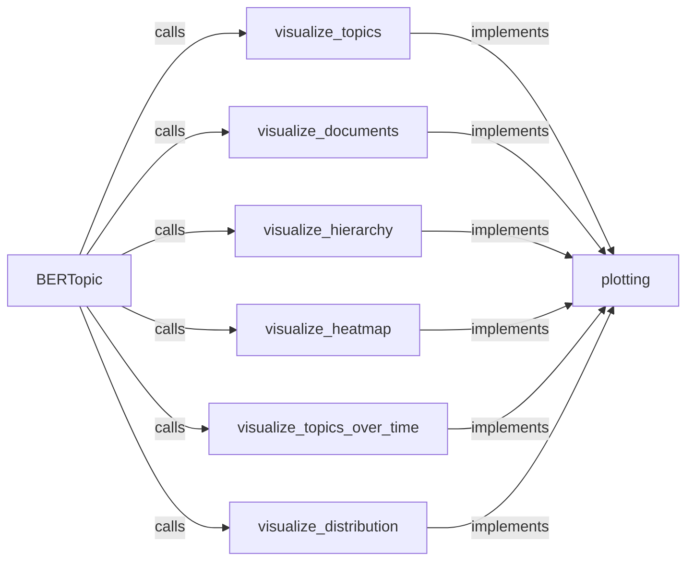

## Component Details

The Visualization Engine in BERTopic provides a suite of tools for visualizing and interpreting topic models. It allows users to explore topic distributions, document-topic assignments, topic hierarchies, and temporal dynamics, offering insights into the discovered topics and their relationships to documents. The engine leverages Plotly for interactive visualizations and is accessed through the BERTopic class.

### BERTopic
The main class in BERTopic, serving as the entry point for accessing various visualization methods. It orchestrates calls to the plotting module to generate visualizations based on the topic model's data.
- **Related Classes/Methods**: `BERTopic.bertopic._bertopic.BERTopic`

### plotting
This module contains the implementation of the visualization functions. It uses Plotly to create interactive plots for topics, documents, hierarchies, and other aspects of the topic model.
- **Related Classes/Methods**: `BERTopic.bertopic.plotting`

### visualize_topics
Generates an interactive visualization of the topics and their most representative words using Plotly. It is called from the BERTopic class and uses the `_plotly_topic_visualization` function in the plotting module to create the visualization.
- **Related Classes/Methods**: `BERTopic.bertopic._bertopic.BERTopic:visualize_topics`, `BERTopic.bertopic.plotting._topics:visualize_topics`

### visualize_documents
Visualizes the documents in the topic model, typically using a dimensionality reduction technique to project documents into a 2D space. This allows for visualizing clusters of documents related to specific topics.
- **Related Classes/Methods**: `BERTopic.bertopic._bertopic.BERTopic:visualize_documents`

### visualize_hierarchy
Visualizes the hierarchical relationships between topics, typically using a dendrogram or similar hierarchical representation. It uses the `_get_annotations` helper function to generate annotations for the hierarchical structure.
- **Related Classes/Methods**: `BERTopic.bertopic._bertopic.BERTopic:visualize_hierarchy`, `BERTopic.bertopic.plotting._hierarchy:visualize_hierarchy`

### visualize_heatmap
Visualizes the similarity between topics using a heatmap, where the color intensity represents the degree of similarity between topic pairs.
- **Related Classes/Methods**: `BERTopic.bertopic._bertopic.BERTopic:visualize_heatmap`, `BERTopic.bertopic.plotting._heatmap:visualize_heatmap`

### visualize_topics_over_time
Visualizes how the importance and prevalence of topics change over time, providing insights into the temporal dynamics of the topics.
- **Related Classes/Methods**: `BERTopic.bertopic._bertopic.BERTopic:visualize_topics_over_time`

### visualize_distribution
Visualizes the distribution of topics across the entire corpus or within specific subsets of the data.
- **Related Classes/Methods**: `BERTopic.bertopic._bertopic.BERTopic:visualize_distribution`
