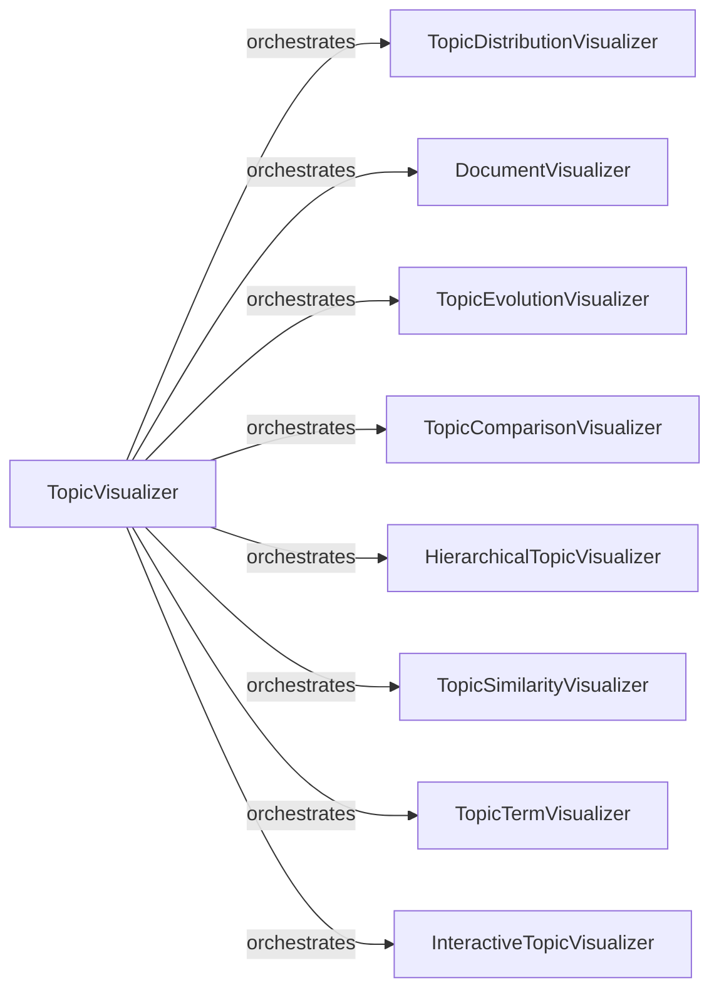

## Component Details

### TopicVisualizer
The TopicVisualizer component serves as a central hub for generating various visualizations related to topic modeling. It orchestrates the creation of plots that represent topic distributions, document relationships, hierarchical topic structures, and topic evolution over time. This component leverages other specialized visualization components to provide a comprehensive suite of tools for exploring and understanding the topic model's structure and dynamics.
- **Related Classes/Methods**: `bertopic/plotting/*`

### TopicDistributionVisualizer
This component focuses on visualizing the distribution of topics within the model. It generates plots that illustrate the relative prevalence of each topic, providing insights into the overall topic landscape. It includes functionalities for both standard and approximate distribution visualizations, catering to different levels of detail and computational efficiency.
- **Related Classes/Methods**: `bertopic/plotting/_distribution.py`, `bertopic/plotting/_approximate_distribution.py`

### DocumentVisualizer
The DocumentVisualizer component is responsible for visualizing the relationships between documents within the topic model. It generates interactive plots that allow users to explore how documents are clustered and related to different topics. This component also includes functionalities for visualizing document datamaps and hierarchical document structures, providing different perspectives on document relationships.
- **Related Classes/Methods**: `bertopic/plotting/_documents.py`, `bertopic/plotting/_datamap.py`, `bertopic/plotting/_hierarchical_documents.py`

### TopicEvolutionVisualizer
This component specializes in visualizing how topics evolve over time. It generates plots that show the changes in topic prevalence and composition over a specified period. This allows users to understand the dynamic nature of topics and how they shift and change over time.
- **Related Classes/Methods**: `bertopic/plotting/_topics_over_time.py`

### TopicComparisonVisualizer
The TopicComparisonVisualizer component enables the comparison of topic distributions across different classes or categories. It generates plots that show how topics are distributed within each class, allowing users to identify differences and similarities in topic prevalence across different groups.
- **Related Classes/Methods**: `bertopic/plotting/_topics_per_class.py`

### HierarchicalTopicVisualizer
This component focuses on visualizing the hierarchical structure of topics within the model. It generates dendrograms that represent the hierarchical relationships between topics, allowing users to explore the topic hierarchy and identify broader and more specific topic clusters.
- **Related Classes/Methods**: `bertopic/plotting/_hierarchy.py`

### TopicSimilarityVisualizer
The TopicSimilarityVisualizer component visualizes the similarity between topics using a heatmap. This allows users to quickly identify which topics are closely related and which are more distinct, providing insights into the overall topic structure.
- **Related Classes/Methods**: `bertopic/plotting/_heatmap.py`

### TopicTermVisualizer
This component visualizes the terms associated with each topic, typically using a bar chart. It displays the most important words for each topic, providing a clear representation of the topic's content and meaning. It also includes functionalities for visualizing term ranks, showing the importance of terms within each topic.
- **Related Classes/Methods**: `bertopic/plotting/_barchart.py`, `bertopic/plotting/_term_rank.py`

### InteractiveTopicVisualizer
This component generates interactive visualizations of the topics and their corresponding words using Plotly. It provides a dynamic and interactive way to explore the topic model, allowing users to zoom, pan, and hover over the plot to gain more detailed information.
- **Related Classes/Methods**: `bertopic/plotting/_topics.py`, `bertopic/plotting/_topics/_plotly_topic_visualization.py`
