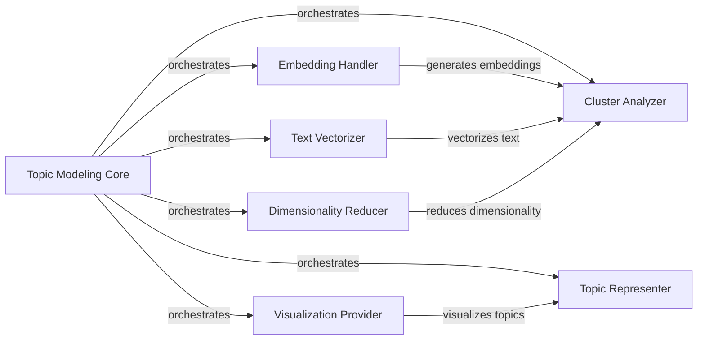

## Component Details

### Topic Modeling Core
This component serves as the central orchestrator for the entire topic modeling process. It initializes and manages all other components, fits the topic model to the data, transforms documents, extracts topic representations, and provides functionalities for topic manipulation and visualization. It also handles saving and loading models, providing a single point of entry for interacting with the BERTopic model.
- **Related Classes/Methods**: `bertopic/_bertopic.py`, `bertopic/_save_utils.py`

### Embedding Handler
This component is responsible for generating document embeddings using various backend models. It abstracts the embedding process, allowing the system to easily switch between different embedding techniques such as Sentence Transformers, Flair, Spacy, and Hugging Face Transformers. It selects the appropriate embedding model based on configuration and handles the conversion of documents into numerical vectors.
- **Related Classes/Methods**: `bertopic/backend/*`, `bertopic/_utils.py`

### Text Vectorizer
This component converts text data into numerical representations suitable for topic modeling. It includes a custom CTfidfVectorizer optimized for topic extraction. It handles tokenization, vocabulary creation, and TF-IDF weighting to create a matrix representation of the text data, which is then used for topic modeling.
- **Related Classes/Methods**: `bertopic/vectorizers/*`

### Cluster Analyzer
This component performs clustering on the document embeddings to identify distinct topics. It primarily uses HDBSCAN for clustering but can be extended with other clustering algorithms. It determines the optimal number of clusters and assigns documents to their respective topics, forming the basis for topic identification.
- **Related Classes/Methods**: `bertopic/cluster/*`

### Dimensionality Reducer
This component reduces the dimensionality of document embeddings to improve clustering performance and reduce noise. It employs techniques like PCA or UMAP to project the high-dimensional embeddings into a lower-dimensional space while preserving the essential structure of the data, making the clustering process more efficient and accurate.
- **Related Classes/Methods**: `bertopic/dimensionality/*`

### Topic Representer
This component generates representative descriptions for each topic. It uses techniques like Maximal Marginal Relevance (MMR), KeyBERT, and integration with LLMs (OpenAI, Cohere, etc.) to extract keywords and phrases that best describe the topics. It aims to provide human-interpretable labels for each identified topic, making the results more accessible and understandable.
- **Related Classes/Methods**: `bertopic/representation/*`

### Visualization Provider
This component provides a suite of visualization tools for exploring the topic model. It includes visualizations for topic distributions, document relationships, hierarchical topic structures, and topic evolution over time. It allows users to gain insights into the structure and dynamics of the topics, facilitating a deeper understanding of the data.
- **Related Classes/Methods**: `bertopic/plotting/*`