```mermaid
graph LR
    BERTopic_Core["BERTopic Core"]
    Embedding_Handler["Embedding Handler"]
    Dimensionality_Reducer["Dimensionality Reducer"]
    Cluster_Manager["Cluster Manager"]
    Topic_Representation_Extractor["Topic Representation Extractor"]
    Vectorizer_Handler["Vectorizer Handler"]
    Visualization_Engine["Visualization Engine"]
    BERTopic_Core -- "orchestrates" --> Embedding_Handler
    BERTopic_Core -- "orchestrates" --> Dimensionality_Reducer
    BERTopic_Core -- "orchestrates" --> Cluster_Manager
    BERTopic_Core -- "orchestrates" --> Topic_Representation_Extractor
    BERTopic_Core -- "orchestrates" --> Vectorizer_Handler
    BERTopic_Core -- "orchestrates" --> Visualization_Engine
    Embedding_Handler -- "embeds documents using" --> Vectorizer_Handler
    Dimensionality_Reducer -- "reduces dimensions of" --> Embedding_Handler
    Cluster_Manager -- "clusters embeddings from" --> Dimensionality_Reducer
    Topic_Representation_Extractor -- "extracts topic representations from" --> Cluster_Manager
    Vectorizer_Handler -- "vectorizes documents for" --> Embedding_Handler
    Visualization_Engine -- "visualizes results from" --> BERTopic_Core
    click BERTopic_Core href "https://github.com/CodeBoarding/GeneratedOnBoardings/blob/main/BERTopic/BERTopic Core.md" "Details"
    click Embedding_Handler href "https://github.com/CodeBoarding/GeneratedOnBoardings/blob/main/BERTopic/Embedding Handler.md" "Details"
    click Dimensionality_Reducer href "https://github.com/CodeBoarding/GeneratedOnBoardings/blob/main/BERTopic/Dimensionality Reducer.md" "Details"
    click Cluster_Manager href "https://github.com/CodeBoarding/GeneratedOnBoardings/blob/main/BERTopic/Cluster Manager.md" "Details"
    click Topic_Representation_Extractor href "https://github.com/CodeBoarding/GeneratedOnBoardings/blob/main/BERTopic/Topic Representation Extractor.md" "Details"
    click Vectorizer_Handler href "https://github.com/CodeBoarding/GeneratedOnBoardings/blob/main/BERTopic/Vectorizer Handler.md" "Details"
    click Visualization_Engine href "https://github.com/CodeBoarding/GeneratedOnBoardings/blob/main/BERTopic/Visualization Engine.md" "Details"
```

## Component Details

The BERTopic library provides a comprehensive topic modeling framework that leverages transformer models and c-TF-IDF to create dense clusters allowing for easy interpretablity. The core flow involves embedding documents, reducing dimensionality, clustering embeddings to form topics, and extracting representative words for each topic. The library also offers visualization tools for exploring the topic model and saving/loading functionality for persistence.

### BERTopic Core
The central orchestrator of the topic modeling process. It manages the lifecycle of the model, from initialization and fitting to transforming documents and updating topic representations. It provides the main interface for users to interact with the library and access its functionalities.
- **Related Classes/Methods**: `BERTopic.bertopic._bertopic.BERTopic`, `BERTopic.bertopic._save_utils`, `BERTopic.bertopic._utils`

### Embedding Handler
Responsible for converting documents and words into numerical vector representations. It supports various embedding techniques, including transformer models and word embeddings, providing a unified interface for different embedding methods. The generated embeddings are used for dimensionality reduction and clustering.
- **Related Classes/Methods**: `BERTopic.bertopic.backend._base.BaseEmbedder`, `BERTopic.bertopic.backend._flair.FlairBackend`, `BERTopic.bertopic.backend._sentencetransformers.SentenceTransformerBackend`, `BERTopic.bertopic.backend._word_doc.WordDocEmbedder`, `BERTopic.bertopic.backend._openai.OpenAIBackend`, `BERTopic.bertopic.backend._use.USEBackend`, `BERTopic.bertopic.backend._model2vec.Model2VecBackend`, `BERTopic.bertopic.backend._hftransformers.HFTransformerBackend`, `BERTopic.bertopic.backend._sklearn.SklearnEmbedder`, `BERTopic.bertopic.backend._multimodal.MultiModalBackend`, `BERTopic.bertopic.backend._spacy.SpacyBackend`, `BERTopic.bertopic.backend._cohere.CohereBackend`, `BERTopic.bertopic.backend._fastembed.FastEmbedBackend`, `BERTopic.bertopic.backend._gensim.GensimBackend`, `BERTopic.bertopic.backend._utils`

### Dimensionality Reducer
Reduces the dimensionality of document embeddings to improve clustering performance and reduce noise. It employs techniques like UMAP to project high-dimensional embeddings into a lower-dimensional space, preserving semantic relationships between documents for efficient topic modeling.
- **Related Classes/Methods**: `BERTopic.bertopic.dimensionality._base`, `BERTopic.bertopic.dimensionality`

### Cluster Manager
Groups reduced-dimensional embeddings into clusters, where each cluster represents a topic. It uses HDBSCAN to identify clusters of documents with high similarity, determining the topic to which each document belongs.
- **Related Classes/Methods**: `BERTopic.bertopic.cluster._base`, `BERTopic.bertopic.cluster._utils`, `BERTopic.bertopic.cluster`

### Topic Representation Extractor
Extracts representative words and phrases for each topic, providing a human-interpretable description of the topic's content. It uses c-TF-IDF to identify characteristic words and supports customization with techniques like KeyBERT or OpenAI to refine topic representations.
- **Related Classes/Methods**: `BERTopic.bertopic.representation._base`, `BERTopic.bertopic.representation._mmr.MaximalMarginalRelevance`, `BERTopic.bertopic.representation._litellm.LiteLLM`, `BERTopic.bertopic.representation._visual.VisualRepresentation`, `BERTopic.bertopic.representation._textgeneration.TextGeneration`, `BERTopic.bertopic.representation._openai.OpenAI`, `BERTopic.bertopic.representation._langchain.LangChain`, `BERTopic.bertopic.representation._keybert.KeyBERTInspired`, `BERTopic.bertopic.representation._cohere.Cohere`, `BERTopic.bertopic.representation._llamacpp.LlamaCPP`, `BERTopic.bertopic.representation._pos`, `BERTopic.bertopic.representation._zeroshot`, `BERTopic.bertopic.representation._utils`, `BERTopic.bertopic.representation`

### Vectorizer Handler
Converts input documents into a numerical matrix representation for topic modeling. It uses CountVectorizer or other vectorization techniques to create a vocabulary of words and count their occurrences in each document, serving as input for embedding and clustering.
- **Related Classes/Methods**: `BERTopic.bertopic.vectorizers._ctfidf`, `BERTopic.bertopic.vectorizers._online_cv.OnlineCountVectorizer`, `BERTopic.bertopic.vectorizers`

### Visualization Engine
Provides visualization tools for exploring and understanding the topic model. It offers visualizations of topic distributions, document-topic assignments, topic hierarchies, and other aspects of the model, helping users gain insights into the topics discovered and their relationships to documents.
- **Related Classes/Methods**: `BERTopic.bertopic.plotting._heatmap`, `BERTopic.bertopic.plotting._hierarchy`, `BERTopic.bertopic.plotting._approximate_distribution`, `BERTopic.bertopic.plotting._topics`, `BERTopic.bertopic.plotting._distribution`, `BERTopic.bertopic.plotting._documents`, `BERTopic.bertopic.plotting._datamap`, `BERTopic.bertopic.plotting._hierarchical_documents`, `BERTopic.bertopic.plotting._term_rank`, `BERTopic.bertopic.plotting._topics_over_time`, `BERTopic.bertopic.plotting._topics_per_class`, `BERTopic.bertopic.plotting`